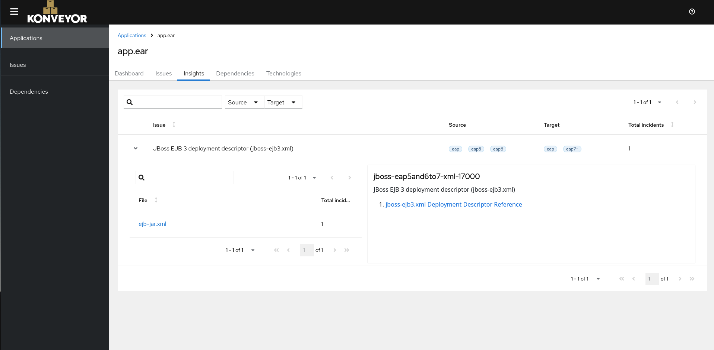

# Analysis Insights

Tagging rules are special kind of rules that generate string tags for an application instead of issues (or violations). They are often used to identify presence of certain technologies, frameworks etc in an application. Unlike issues, tags don't have metadata associated with them such as incidents, effort, category, message etc. 

This enhancement introduces an idea to expand the scope of information associated with tags. It introduces a new concept "Analysis Insights" to help express this new information in analysis output and static report.

## Motivation

Sometimes users want to see where exactly in the code a certain technology, framework etc are used. While tagging rules can express presence of a technology, they do not show the code location. For a migrator familiar with the tech stack of the application, it is helpful to see code locations where a technology is used. For instance, consider a rule that identifies usage of a deprecated technology that is not a migration problem today. Often such rules have no effort assigned. One might argue that these rules can simply have a _message_ field defined so that they generate violations when needed. But in that case, the rule awkardly generates a _violation_ without an effort or a category, and it ends up being displayed as a migration issue. We can find such rules in our existing rulesets. See an example below:

```yaml
- category: potential
  customVariables: []
  description: RESTful Web Services @Context annotation has been deprecated
  effort: 0
  message: Future versions of this API will no longer support `@Context` and related
    types such as `ContextResolver`.
  ruleID: jakarta-ws-rs-00001
  when:
    java.referenced:
      location: ANNOTATION
      pattern: jakarta.ws.rs.core.Context
```

_See full rule[here](https://github.com/konveyor/rulesets/blob/d930baf2645d6a7ef9486c4f81bc40d8abc3a6af/default/generated/eap8/160-jakarta-ws-rs.windup.yaml#L1-L22)_


This is a rule that is looking for a deprecated API. Since this is not really affecting the migration right now, the effort is 0. But this can become a problem in the future. Therefore, the rule author categorized it as "information" (since this category doesn't exist in new analyzer, it defaults to potential). While a tag is sufficient to express the presence of this API, the author's intent was to also warn the user with a message. A similar [use-case](https://github.com/konveyor/rulesets/issues/69) has been discussed in the Konveyor community earlier.

The main argument against showing this information as "issues" is that it clutters the view. A large proportion of users are only interested in issues that affect migration. Meaning, issues that have non-zero effort and have a well-defined category. We do not intend to change that behvior with this enhancement. 

While keeping the violations or issues as-is, we propose a new section in the analyzer output called "insights". It will contain _violation_ type for each tagging rule that matched with fine grained incidents. The only difference between an issue and an insight will be that the insights will not have a category and effort.

We also propose a counterpart of this new section in the static report in the form of a tab in the application details page. Note that scope of the changes discussed in this enhancement is limited to analyzer-lsp and static report.

### Goals

* Discuss use-case for application insights
* Briefly discuss API change in analyzer lsp
* Briefly discuss static report changes

### Non-Goals

* Discuss how application insights are surfaced in Konveyor Hub

## Use case

_As a migrator, I want to understand where exactly a technology is used in the project so that I can assess whether it requires a change such as an upgrade, removal or replacement_

Application insights are targeted towards a migrator who is familiar with the technical aspects of an application. Tags provide a general coarse-grained picture at portfolio level, insights provide zoomed-in picture at application level.

## Proposal

### Changes to analyzer output

We propose a new section in analysis output referred to as "insights".

Incidents along with their variables are a powerful way to express information about a code location. We want to leverage that. This new section will contain the same fields as a violation except effort and category. See an example output below that contains insights:

```yaml
- name: konveyor-analysis
  tags:
  - Go-1.18
  violations:
    replace-dependency:
      description: "this dependency is bad"
      category: mandatory
      effort: 3
      incidents:
      - uri: file:///examples/golang/go.mod
        lineNumber: 3
        message: "replace this dependency with that"
  insights:
    go-18-found:
      description: "Go-1.18"
      incidents:
      - uri: file:///examples/golang/go.mod
        message: "consider upgrading to go 1.22"
```

The _message_ field in the example above won't always be created. See [this section](#rules-that-generate-insights) to understand when it will be created.

For reference, see the full _Violation_ type below:

```go
type Violation struct {
	Description string `yaml:"description" json:"description"`

	Category *Category `yaml:"category,omitempty" json:"category,omitempty"`

	Labels []string `yaml:"labels,omitempty" json:"labels,omitempty"`

	Incidents []Incident `yaml:"incidents" json:"incidents"`

	Links []Link `yaml:"links,omitempty" json:"links,omitempty"`

	Extras json.RawMessage `yaml:"extras,omitempty" json:"extras,omitempty"`

	Effort *int `yaml:"effort,omitempty" json:"effort,omitempty"`
}
```

Since _Category_ and _Effort_ are pointers, they will be set to nil and omitted in the output.

Full output will look like:

```go
type RuleSet struct {
	Name string `yaml:"name,omitempty" json:"name,omitempty"`

	Description string `yaml:"description,omitempty" json:"description,omitempty"`

	Tags []string `yaml:"tags,omitempty" json:"tags,omitempty"`

	Violations map[string]Violation `yaml:"violations,omitempty" json:"violations,omitempty"`

  // This is the field we are adding
	Insights map[string]Violation `yaml:"insights,omitempty" json:"insights,omitempty"`

	Errors map[string]string `yaml:"errors,omitempty" json:"errors,omitempty"`

	Unmatched []string `yaml:"unmatched,omitempty" json:"unmatched,omitempty"`

	Skipped []string `yaml:"skipped,omitempty" json:"skipped,omitempty"`
}
```

### Changes to static report

We will introduce a new tab in the application details page:



The page is similar to issues page except theres no category or effort.

### Rules that generate insights

_Rules that do not have an effort value defined or have an effort value of 0, will generate insights._

Depending on what rule actions they define, the output will look different. See following table for all scenarios:

| <rule>.effort | <rule>.tag | <rule>.message |  Description |
| --- | --- | --- | --- |
| 0 | Defined | Not Defined | Rule creates _tags_ and an _insight_. Insight does not contain _message_. |
| 0 | Defined | Defined | Rule creates _tags_ and an _insight_. Insight contains _message_. | 
| 0 | Not Defined | Defined | Rule creates an _insight_. Insight contains _message_. | 
| 1 | Defined | Defined | Rule creates _tags_ and a _violation_. No insights here as effort is non-zero. |

Note that every insight that was crated by a tagging rule, will be tied back to that tag using a label `konveyor.io/tag=<val>`. This allows us to have filtering logic in the UI based on labels.


## Implementation Details / Concerns

### There can be too much data generated

Although the new information is separated into its own section, the output can grow because incidents from tags can be repetitive. Right now, in this enhancement, we are not proposing a solution for reducing unnecessary data. But there's an ask from the community for a feature that [allows rule authors to suppress information](https://github.com/konveyor/rulesets/issues/70). I think that ties into here perfectly. In future, we can have a switch on the rule itself that allows tweaking what gets generated. For now, we already have incident limits to limit the total number of incidents. We do not expect to see output size increase exponentially with the proposed changes. 

## Upgrade / Downgrade concerns

The new field _insights_ is an optional field. Older reports will simply omit this field. In case of static report UI, any existing report will have an empty state in in insights tab. Similarly, a new report should continue working with older format as long as the new field is optional. 


