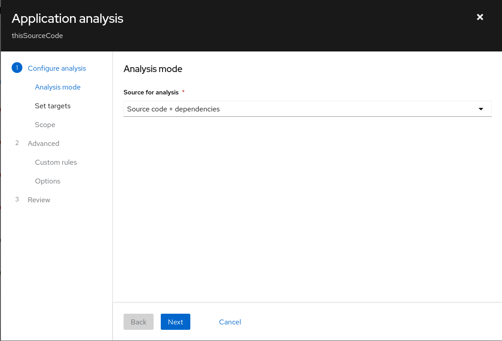

## Summary

When starting the analysis wizard, and selecting the analysis mode, a better default choice could be automatically made. This can avoid the case where there is a validation message displayed by static default choice. For example, we would like to avoid the analysis wizard opening looking like this: [Analysis mode](images/application-analysis.png "Application analysis")

## Motivation

The default mode at the beginning will be determined by the type of application loaded, and the user will be able to select the analysis mode with a single-selection drop-down menu, like this: 

### Goals

This change saves the user from having to choose the most suitable mode, and does it himself by a function that defines the optimal mode to be default.