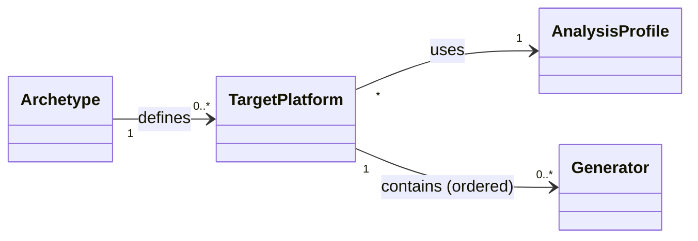

# Centralized Configuration Management


## Release Signoff Checklist

- [ ] Enhancement is `implementable`
- [ ] Design details are appropriately documented from clear requirements
- [ ] Test plan is defined
- [ ] User-facing documentation is created

## Open Questions

- Since architects are expected to be in charge of managing *Analysis Profiles*, shouldn’t they be in charge of managing Migration Paths as well? Should the Migration Paths management view be moved from the Administration Perspective into the Migration Perspective?

## Summary

This enhancement aims at enabling organizations to enforce standards across the different components of the Konveyor architecture (Hub, CLI and IDE plugin) by centralizing configuration management in the Hub. From an organizational standpoint, this enhancement proposes enabling Konveyor to provide a **Platform Engineering approach to Migration and Modernization**, based on the following principles:
- Enable organizations to enforce standard practices and configurations to be easily followed by all developers involved in the migration initiative.
- Harmonize concepts and abstractions across all components.
- Enable connectivity between the local components (IDE Plugins, CLI) and the central Hub:
  - Share application data across components:
    - Discovery derived (Archetype, Target Platforms…).
    - Analysis results.
  - Synchronize configuration defined by architects in the Hub:
    - Analysis configuration.
    - LLM configuration.
  - Abstract developers from managing the lifecycle of custom rules in their local development environments.


## Motivation

With the inclusion of the IDE plugin, the detachment in the current component architecture has become apparent with some abstractions:
- Custom migration paths are aimed at simplifying the user interaction with rules, but are only present at the Hub.
- *Analysis Profiles* brilliantly simplify analysis configuration management, but are only present in the IDE plugin.
- There’s no way to enforce corporate standards for users of the IDE plugin and CLI. Architects invest a lot of time in modeling Tags, Archetypes, Target Platforms and Custom Migration Paths in the Hub to get the best representation of their organization and their intended migration plan, but those concepts don’t exist on the local/client side components.


### Goals

- Enable Architects to manage organization wide configuration in the Hub.
- Bring the *Analysis Profiles* abstraction to the Hub.
- Remove the need for developers to configure LLMs locally in their plugin.
- Streamline and simplify the distribution and usage of custom rules in the corporate environment.
- Allow developers to stay focused on migration (analysis and fixing of issues) without having to actively take care of staying aligned with corporate standards.
- Enable organizations to lock the Konveyor IDE plugin to only work with the configuration served by the Hub to enforce alignment with corporate practices and remove non meaningful options for the migration initiative.

### Non-Goals

- Establishing auditing mechanisms in the Hub about IDE or CLI usage.


## Proposal

### Personas / Actors

#### Administrator

The administrator for the tool that has access to some application-wide configuration parameters that other users can consume but not change or browse.

#### Architect

A technical lead for the migration project that can create and modify applications and information related to them.

#### Migrator

Developers in charge of migrating specific applications. They perform changes to the source code in their IDE environments. They can only consume configuration managed by Administrators and Architects to run the resolution flows for issues found by analysis.


### User Stories

#### Web-UI
1. As an __architect__, I want to manage the set of defined analysis profiles.  This includes the standard view, create, edit, and delete functions.
2. As an __architect__, I want to attach an existing analysis profile to an archetype's target profile.  The analysis profiles and asset generator list will be managed on the same target profile.
3. As an __architect__ or __migrator__, when opening the Analysis Wizard, I want to be able to use the analysis wizard as it is currently available.
4. As an __architect__, when opening the Analysis Wizard, I want to be able to use the analysis wizard as it is currently available, and in the final confirmation step, be able to save my configuration as a new analysis profile.
5. As an __architect__ or __migrator__, when opening the Analysis Wizard, I want to be able to select an analysis profile available via one of the application's archetype target profiles.
6. As an __architect__, when opening the Analysis Wizard, I want to be able to select an analysis profile from all defined profiles.

#### IDE
1. As a __migrator__, I want to connect to my hub instance.
2. As a __migrator__, I want to select an analysis profile for the application I am working on.
3. As a __migrator__, I want to use the hub connected analysis profile.

#### CLI
1. As a __migrator__, I want to connect to my hub instance.
2. As a __migrator__, I want to select an analysis profile for the application I am working on.
3. As a __migrator__, I want to run an analysis using the selected analysis profile.

### Functional Specification

#### IDE

##### Standard Flow

The following mockups provide an approach on how Centralized Configuration Management could be implemented on the IDE side from a functional perspective.


##### Centralized Configuration Locking

Large organizations with strict standards are likely to want to lock MTA to work only with centralized configuration. This won’t be possible in a local VS Code environments, where users will have the freedom to enable and disable centralized configuration. Nevertheless, it could be enforced in Eclipse Che environments where configuration (and environment variables) are prepopulated and users don't have control over environment variables. In order to facilitate this, the proposal is to enable the MTA plugin to completely lock local user configuration and enforce centralized configuration via environment variables:

- KONVEYOR_CENTRALIZED_CONFIG: If set to true, local configuration will be disabled.
- KONVEYOR_HUB_URL: Contains the URL for the Konveyor/MTA Hub the IDE plugin will have to connect to. Ignored if KONVEYOR_CENTRALIZED_CONFIG is not true.
- KONVEYOR_ALLOW_INSECURE_CONNECTIONS: Allows the plugin to connect to Hub instances with self signed certificates. Ignored if the other two environment variables are not set.

The following mockups provide an approach on the impact that those variables would have on the IDE user experience.


#### Hub

- Support inventory of analysis profiles.
- Support (optional) association of an analysis profile with one-or-more [Archetype] Target Platforms.
- Support finding an application based on source repository URL and (optional) root path.
- Support listing profiles for an application as associated through archetypes.
- Support downloading the bundle for an analysis profile. A _bundle_ is a tarball containing the analysis profile.yaml and associated custom rulesets files.

#### Web-UI

##### Manage Analysis Profiles

Add a new page to the __Migration__ menu to allow management of analysis profiles.

This page should follow the typical pattern:
  - The page is rooted at a typical _table view_ of analysis profiles defined on the system:
    - The table displayed base data and useful general statistics about the profiles, as available.
    - A "create a new analysis profile" action will be a table level action.
    - Row level actions should allow "Edit" and "Delete" actions on their row.

  - A _detail drawer_ as required to show more useful detailed read-only information to about an analysis profile:
    - All basic details about an analysis profile
    - A summary view of the settings may be included so it can be viewed without opening the edit modal.

  - The _delete action_ will require a confirmation before deleting.  Any analysis profile that is attached to an archetype target profile either needed to be prevented from being deleted, or removed from the target profile when deleted.

  - The _create_ and _edit_ action may share the same modal.  Since the analysis profiles can be considered saved settings from the analysis wizard, reusing the same wizard views to create/edit a profile may be useful.  All of the currently available settings on the analysis wizard should be available here as well.

##### Attaching an Analysis Profile to an Archetype Target Profile

Target profiles current exist on Archetypes from the "Manage target profiles" kebab action on an Archetype.  This target profile sub-page will be enhanced to also allow attaching a single analysis profile to each of the archetype's target profiles.



Update the _target profile page_:
  - Display the selected Analysis Profile on the _table_
  - Update the _create/edit modal_ to add an Analysis Profile section to allow search and selection of an existing Analysis Profile
  - Allow creation of a target profile _without selecting Generators_.

On the Archetype page, add the selected analysis profile to the _details drawer target profile tab_.

##### Analysis Wizard

The analysis wizard will need to retain its current behavior, but be extended such that the user either progresses with the normal _manual flow_, or chooses to use an _analysis profile flow_.

If an __architect__ is using the normal _manual flow_, an option to save the configuration as an analysis profile will be added on the review step.  This should dynamically add an extra wizard step to collect the data needed to both run the analysis and store the analysis as an analysis profile.

If using the _analysis profile flow_, the user will select an analysis profile and start the analysis:
  - No modifications to the profile will be allowed.
  - If the user is a __migrator__, the user may select an analysis profile that has been attached to one of the applications' archetype target profiles.
  - If the user is an __architect__, the user may select an analysis profile that has been attached to one of the applications' archetype target profiles or any analysis profile available on the system.

##### Custom migration targets

Currently, the custom migration target management page is scoped to the Administrator perspective. To support the configuration management enhancement, the management page needs to be moved to the Migration perspective.

  - __Migrator__ users can view the migration targets
  - __Architect__ users can create, edit, remove custom targets and change the target order

##### Navigation menu for the Migration perspective

The current navigation menu in the Migration perspective is flat and doesn't differentiate between page intent. The navigation can potentially be reorganized and grouped around:
  - Inputs / Applications / Primary entities and flows
  - Outputs / Reporting
  - Non-Administrator managed Configuration and Tools

Any change to the navigation should have the intention to make the Migration perspective more intuitive to use.

### Implementation Details/Notes/Constraints

#### IDE Implementation

The IDE will be enhanced to support centralized configuration management from Konveyor Hub through the following changes:

##### Hub Connection Management

Extend the existing solution server configuration mechanism to include Hub connectivity. Users will configure Hub connection details (URL, credentials) similar to how they currently configure the AI solution server. The IDE will support both standalone solution server mode and Hub-managed mode where configuration is synchronized from the Hub.

##### Profile Synchronization

A sync engine will be added to the IDE that:
1. Uses the repository's git remote URL to identify the corresponding Application in the Hub
2. Retrieves available analyzer profile IDs from the Hub for that Application
3. Downloads profile bundles (profile configuration + rulesets) as tarballs from the Hub
4. Writes profiles to disk in a shared format readable by both the IDE and Kantra CLI

The sync engine will implement conflict mitigation strategies such as pausing synchronization during active analysis operations to prevent reading partially-written configuration.


#### CLI Implementation

The CLI will support centralized configuration management from the Konveyor Hub through the following:

##### Hub Connection

The CLI will add a new subcommand `config` for interacting with the Hub.
This subcommand will include a `--login` option to prompt for Hub login information:

`kantra config login`

`Hub URL:`
`Username:`
`Password:`

##### Profile Synchronization

Once connected to the Hub, the CLI can retrieve associated profiles given an application's remote URL:

`kantra config --sync <app>`

The CLI will download any appropriate profile bundles (profile + rulesets) from the Hub.
If logged in, this will automatically be attempted if the Hub application has
been updated.

##### Running Analysis from a Centralized Config

The `--profile` flag will allow analysis configuration from a profile.

`kantra analyze --profile profile-1 ...`

To list available on-disk profiles: `kantra config --list-profiles <app>`.

The profile will be verified against the server-side configuration. If it is not in sync,
the CLI will provide the following options:
- Update the existing local profile.
- Keep the existing local profile.

Alternatively, profiles will always be overwritten.

If a profile is found at the expected location in the applicaiton, it will be used
by default. An override flag or enviroment variable can be set to change this
behavior.


#### IDE and CLI: Shared Profile Format

The IDE and CLI will align on a common on-disk representation of analyzer profiles.

Example `profile.yaml`
```yaml
metadata:
  name: eap7-to-eap8
  id: hub-profile-123
  source: hub
  syncedAt: "2025-10-15T12:00:00Z"
  version: "1.2.3"
spec:
  rules:
    labelSelectors:
      - "konveyor.io/target=eap8"
    rulesets:
      - "./rulesets/eap-migration.yaml"
      - "./rulesets/java-ee-to-jakarta.yaml"
    useDefaultRules: false
    withDepRules: true
  scope:
    depAanlysis: true
    withKnownLibs: false
    packages:
      - "!package=com.example.apps"
      - "package=com.example.apps2"
  # Hub-specific metadata
  hubMetadata:
    applicationId: "app-456"
    profileId: "profile-123"
    readonly: true  # Hub profiles cannot be edited locally
```

This shared format will be stored in the repository (proposed location: `.konveyor/profiles/`) and support:
- Multiple profiles per repository
- Profile metadata including source (bundled/user/hub), version, and sync state
- Associated rulesets bundled with each profile
- Hub-sourced profiles marked as read-only to prevent local modifications

#### IDE and CLI: Configuration Precedence

The IDE and CLI will consume configuration from multiple sources following the precedence model defined in the UX design:
- Environment variables
- Hub-synchronized profiles
- Local user preferences
- Bundled defaults


## Design Details

### Test Plan

TBD

### Upgrade / Downgrade Strategy

TBD

## Implementation History

TBD

## Drawbacks

TBD

## Alternatives

TBD

## Infrastructure Needed

TBD
