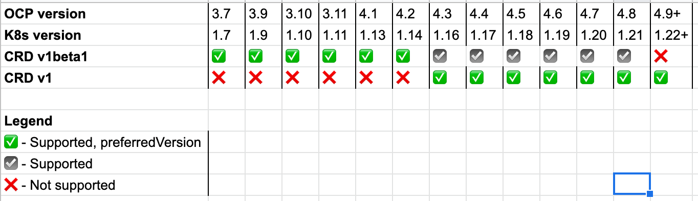

# CRD v1beta1 API deprecation handling via remote install

## Summary

This enhancement proposes Crane handling the upcoming removal of `apiextensions/v1beta1` from OCP 4.9 by:

- Dropping support for OCP 3.x as _control clusters_ 
- Dropping support for mig-operator to run on OCP 3.x. 
- Enhancing the MigCluster controller to perform remote install of dependencies such as Velero, Restic, and mig-log-reader.
- Dynamically installing a suitably versioned set of Velero CRDs on the remote cluster 

Users currently have the choice of which cluster (OCP 3.7 - 4.7) to use as the control cluster. This proposal would require users of MTC/Crane 1.6+ to use a minimum of OCP 4.6+ as their _control cluster_ to support `apiextensions/v1`. Although the OCP 4.3 API supported v1 CRDs, OLM lagged and only started supporting CRD v1 in OCP 4.6

_In exchange for dropping OCP 3.x control cluster capability_, we gain the following benefits:

- We can avoid maintaining an additional legacy OCP 3.x compatible version of Crane
  - Test burden on QE is not doubled
  - Backport/CVE/Bugfix burden on devs is not doubled
- Only need to maintain and test one set of Crane CRDs (v1)
- Entire class of bugs related to running mig-controller on OCP 3.x clusters is eliminated


## Motivation

In OpenShift 4.9, the `apiextensions/v1beta1` CustomResourceDefinition (CRD) API will be removed. The replacement API `apiextensions/v1` has been available starting from OpenShift 4.3, with the two versions co-existing from 4.3-4.8. We previously used CRD v1beta1 everywhere, but OpenShift 4.9 represents the first time there is no CRD API version usable across all cluster versions we must support.

This enhancement outlines a strategy to handle this CRD API removal while continuing to inter-operate with 3.7+ clusters so that Crane can serve its core goal of allowing users to migrate OpenShift workloads from 3.7+ to 4.x clusters. 

The two sets of CRDs that Crane/MTC must install are:
- Mig* CRDs (must be installed on the control cluster only)
- Velero CRDs (must be installed on all clusters serving as a source / destination)



### Goals

- Support main migration scenarios we care about as OCP API evolves
- Develop a strategy that can be used in the future when further Kubernetes API deprecations inevitably happen

### Non-Goals

- Introduce high burden of backporting fixes 
- Block introduction of new features/bugfixes into Crane 1.x

## Proposal

Discontinue Crane installation on OCP 3.x with mig-operator. Write remote install functionality to get Crane deps on all remote clusters.


### Common migration scenarios affected by this enhancement:

- **OCP 3.7+ to 4.6+**
  - OCP 4.6+: Install Crane 1.6+ 
  - OCP 3.7+: Install Crane dependencies remotely

- **OCP 4.6+ to 4.6+**
  - OCP 4.6+: Install Crane 1.6+ 
  - OCP 4.6+: Install Crane dependencies remotely

- **OCP 4.5- to 4.6+**
  - OCP 4.6+: Install Crane 1.6+ 
  - OCP 4.5-: Install Crane dependencies remotely

- **OCP 4.5- to 4.5-**
  - No longer possible 

- **OCP 3.7+ to 3.7+**
  - No longer possible

- **On-premises OCP 3.7+ to cloud OCP 4.6+**
  - Would require a "hole-punch" solution for cloud OCP 4.x to reach into network of on-premises OCP 3.x cluster
  - Ideas: we may be able to accomplish this tunnel with [stunnel](https://www.stunnel.org/) or [submariner](https://www.openshift.com/blog/connecting-managed-clusters-with-submariner-in-red-hat-advanced-cluster-management-for-kubernetes)
  - Look to pvc-migrate for ideas
  - Look to proxy work in Crane for ideas

- **Disconnected OCP 3.7+ to disconnected OCP 4.6+**  
  - [Current docs on deploying in a disconnected env](https://github.com/konveyor/mig-operator/blob/master/docs/usage/DisconnectedDeployment.md) 
  - Current docs refer to manually pulling in the mig-operator image. This will not be necessary on OCP 3.7+ since mig-operator won't be present.
  - We will need to provide new user input fields insertable into the MigCluster ConfigMap where users to specify each required disconnected image location. 
  


### Implementation Details/Notes/Constraints

#### Migration of Config that previously lived in MigrationController CR to the MigCluster CR

Config info previously in the MigrationController CR spec on the remote cluster can be migrated upon Crane 1.6 upgrade to a ConfigMap on the control cluster with a `generateName` and `label` matching the corresponding MigCluster name. 

**Example**

```
  - MigCluster 
    - name: `host`
  - ConfigMap 
    - generateName: `migcluster-config-host`
    - name: `migcluster-config-host-8x7ex`
    - labels: 
      - `migration.openshift.io/migcluster-config-for`: `host`
```

No MigCluster API changes should be required, although MigCluster internals and status reporting will need to change. _Read on for upgrade/downgrade considerations_.

#### Moving all Velero (and other remote dependency) setup tasks to MigCluster controller

Even on the control cluster, we should move all Velero, ConfigMap, and mig-log-reader setup tasks to the MigCluster controller so that we only have to maintain one set of templates, and we aren't doing half of our Velero installs in mig-operator, half in mig-controller.

#### Achieving functionality equivalent to mig-operator for Velero dependency install tasks

We may be able to make use of Jinja or Go templates to achieve remote cluster dependency installs.

#### Handling of Velero

##### Velero Option 1 (Preferred): Accepting the burden of maintaining a legacy flavor of Velero

In order to maintain the ability to migrate apps from OCP 3.9+, we will need to continue our legacy maintenence of an older version of Velero compatible with older K8s APIs.

- Velero 1.6.z is the last series of Velero releases that will work with both v1beta1 CRDs and v1 CRDs. 
- Starting with Velero 1.7, we expect that v1beta1 CRDs will not be included. 

Once we have a version of Crane which supports Velero 1.7, two things will be needed:

- __1__: We will need two different sets of velero images: Velero 1.6.z, Velero 1.7+. Each MTC release will need two Velero release branches (release-1.y.z
and release-1.y.z-velero-1.6). We will need to test both branches.
  - velero
  - velero-restic-restore-helper
  - velero-plugin-for-aws
  - velero-plugin-for-gcp
  - velero-plugin-for-microsoft-azure
 
- __2__. Velero 1.6.z is planned to be be out-of-support upstream, which means that we may need to backport CVE and certain bugfixes (essentially blocker bugs that affect backup creation), since upstream CVE and bugfixes will only go to the 
latest releases.
  - We are already running Velero on 3.x clusters in an out-of-support configuration, as Velero 1.6 is only supported on Kubernetes 1.12 and newer.
  - With this change, we will be running no-longer-supported-at-all Velero on a Kubernetes version that this Velero release never officially supported. 
  - We'll be on our own for bugfixes and other issues.

##### Velero Option 2: Modifying up-to-date Velero to generate v1beta1 CRDs

We could modify our Velero fork to continue generating v1beta1 CRDs that upstream will stop
generating after 1.6. 
 
 - This doesn’t reduce our maintenance burden. It shifts it around. 
 - We will now be on the hook for maintaining CRD generation for v1beta1 CRDs for Velero releases that upstream has never generated them for. 
 - There is no guarantee that the upstream releases in question won’t make use of v1 CRD features that are incompatible with v1beta1. 
 
_Beyond CRD concerns_, there’s also no guarantee that upstream won’t make code changes in other
areas that are no longer compatible with legacy Kubernetes versions. The issue here is that
with this scenario, our maintenance burden extends to new feature development rather than simply
backporting bugfixes. When we previously discussed this option, the feeling was that this
alternative is actually riskier than the two-streams-of-velero approach.

#### Requirement for highly-permissioned remote cluster SA token

Currently, mig-operator sets up the `migration-controller` SA that we use to perform actions on the remote cluster. We would need the cluster admin of that cluster to create an SA token for us instead of having mig-operator do this. This should be a trivial difference.

Our clusterrole used for the `migration-controller` SA has some variable templated parts to it, we will need a way to deal with these. [Link to SA jinja template - mig_rbac.yml.j2](https://github.com/konveyor/mig-operator/blob/5a8ce7209b9a62b8afa66fafb877ad0a5d0fbb85/roles/migrationcontroller/templates/mig_rbac.yml.j2). 

#### Generating v1 CRDs

For Crane 1.6+ in mig-controller, patch the [controller-gen command](https://github.com/konveyor/mig-controller/blob/master/Makefile#L60) to generate v1 CRDs instead of v1beta1 ([see example in Velero repo](https://github.com/vmware-tanzu/velero/pull/3614/files#diff-a3e5a2ec9e9650645fbeea6cc08d0c17b3fdc0be893979ca180b329267d12a9cR48-R56)). Copy generated YAML over to mig-operator and run this modified operator against a pair of 3.11 and 4.x clusters. Verify that migrations still run as usual.

#### Blocking cluster upgrades until mig-operator can handle v1 CRDs

The OLM team has outlined steps that we can follow to ensure that the cluster upgrade to OpenShift 4.9 won't proceed until our operator can handle removal of the CRD v1beta1 API.

- Ensure released Crane versions have the required annotation to block upgrades to OCP 4.9 when they are installed.
- Ensure Crane 1.6 is available at time of OCP 4.9 release so that users have a way to unblock their upgrade by switching to Crane 1.6 release stream (will this available Crane version upgrade be obvious to users though?)
  ```
  # Example of blocking cluster upgrade with CSV annotation
  apiVersion: operators.coreos.com/v1alpha1
  kind: ClusterServiceVersion
  metadata:
    annotations:
      # Prevent cluster upgrades to OpenShift Version 4.9 when this
      # bundle is installed on the cluster
      "olm.properties": '[{"type": "olm.maxOpenShiftVersion", "value": "4.8"}]'
  ```

We will also need to configure Crane 1.6 with a minimum install version of OCP 4.3 due to v1 CRDs.

### Risks and Mitigations

- _Risk:_ implementing this will require significant rework of how Velero, Restic, mig-log-reader, and our ConfigMaps are set up on the remote cluster. We currently carry out these setup tasks using Ansible tasks in mig-operator. We would need to create a functional equivalent of this provisioning code in Golang and have it undergo QE regression testing.
  - _Mitigation_: Run all available automated regression tests related to mig-operator settings as a gating factor before merge of these changes.

- _Risk_:  large amounts of documentation refer to the current methods for configuring Crane settings using the _MigrationController_ CR provided by mig-operator. Since this functionality would be moving out of the _MigrationController_ CR, we'd need to change all of our documentation to reflect this. 
  - _Mitigation_: work with docs team early on our solution, letting them know where things will be shifting. 

## Design Details

### Upgrade / Downgrade Strategy

We can provide automatic upgrades to this new method of managing remote cluster Cranes deps, however the downgrade process will be manual.

#### Automatic Upgrade steps (Crane 1.5 to 1.6+):
1. All config values found in MigrationController.spec on the remote cluster would be copied over to new ConfigMap upon MigCluster reconcile
2. Remote mig-operator would be scaled to 0 replicas
3. Run deletion of Velero, Restic, mig-log-reader on remote cluster 
4. Proceed with MigCluster controller provisioning of replacement Velero, Restic, and mig-log-reader.

#### Manual Downgrade steps (Crane 1.6+ to 1.5):
1. User runs `oc delete -f non-olm/mig-operator.yaml` on remote cluster
2. User runs `oc create -f non-olm/mig-operator.yaml` on remote cluster
3. User runs `oc create -f non-olm/operator-3.yaml` on remote cluster
4. User copies config values out of `migcluster-config-` ConfigMap and drops them into remote cluster MigrationController CR


## Alternatives

The original idea proposed as an enhancement was maintaining a legacy 1.5.z release for OCP 3.x clusters that would serve mostly as a Velero installer. Check out the `crd-v1beta1-deprecation` enhancement for more details.