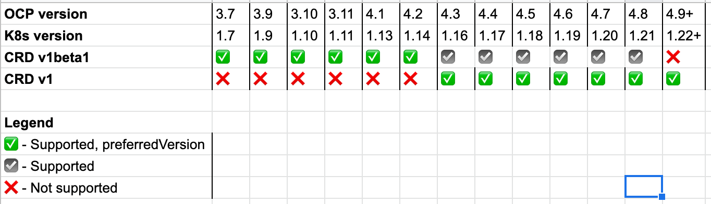

# CRD v1beta1 API deprecation handling

## Summary

This enhancement proposes maintaining a long-term support MTC/Crane 1.5.z version for users with source clusters on OpenShift 3.7 - 3.11 that will remain compatible with `apiextensions/v1beta1` CRDs. This version of MTC/Crane would receive only minor updates:

- CVE patches
- Bug fixes
- Velero updates where possible, though Velero 1.7 may drop v1beta1 CRD support 
- Changes to mig-operator managed ConfigMaps etc. to support small new features introduced in MTC/Crane 1.6+

Users currently have the choice of which cluster (OCP 3.7 - 4.7) to use as the control cluster. This proposal would require users of MTC/Crane 1.6+ to use a minimum of OCP 4.3+ as their _control cluster_ to support `apiextensions/v1`.
 

## Motivation

In OpenShift 4.9, the `apiextensions/v1beta1` CustomResourceDefinition (CRD) API will be removed. The replacement API `apiextensions/v1` has been available starting from OpenShift 4.3, with the two versions co-existing from 4.3-4.8. We previously used CRD v1beta1 everywhere, but OpenShift 4.9 represents the first time there is no CRD API version usable across all cluster versions we must support.

This enhancement outlines a strategy to handle this CRD API removal while continuing to inter-operate with 3.7+ clusters so that Crane can serve its core goal of allowing users to migrate OpenShift workloads from 3.7+ to 4.x clusters. 

The two sets of CRDs that Crane/MTC must install are:
- Mig* CRDs (must be installed on the control cluster only)
- Velero CRDs (must be installed on all clusters serving as a source / destination)



### Goals

- Support main migration scenarios we care about as OCP API evolves
- Develop a strategy that can be used in the future when further Kubernetes API deprecations inevitably happen

### Non-Goals

- Introduce high burden of backporting fixes 
- Block introduction of new features/bugfixes into Crane 1.x

## Proposal

Common migration scenarios can be handled with this strategy:

- OCP 3.x to 4.x
  - Use Crane 1.5.z for OCP 3
  - Use Crane 1.6+ for OCP 4
- OCP 3.x to 3.x
  - Use Crane 1.5.z for OCP 3


The thought is that since Crane 1 is mostly feature-complete, we shouldn't have to backport major API changes to Crane 1.5.z. 

For users in the traditional OCP 3.x -> 4.x migration scenario, Crane 1.5.z will esentially just serve as a Velero and ConfigMap installer, and these operator managed resources shouldn't need changes often if Crane 1.x is in maintenence mode.

We will need to make sure Crane 1.5.z receives matching operator updates. This probably means that some PRs to mig-operator for Crane 1.6+ will also get PR'd to the 1.5.z branch.


### Implementation Details/Notes/Constraints

#### Generating v1 CRDs

For Crane 1.6+ in mig-controller, patch the [controller-gen command](https://github.com/konveyor/mig-controller/blob/master/Makefile#L60) to generate v1 CRDs instead of v1beta1 ([see example in Velero repo](https://github.com/vmware-tanzu/velero/pull/3614/files#diff-a3e5a2ec9e9650645fbeea6cc08d0c17b3fdc0be893979ca180b329267d12a9cR48-R56)). Copy generated YAML over to mig-operator and run this modified operator against a pair of 3.11 and 4.x clusters. Verify that migrations still run as usual.

#### Blocking cluster upgrades until mig-operator can handle v1 CRDs

The OLM team has outlined steps that we can follow to ensure that the cluster upgrade to OpenShift 4.9 won't proceed until our operator can handle removal of the CRD v1beta1 API.

- Ensure released Crane versions have the required annotation to block upgrades to OCP 4.9 when they are installed.
- Ensure Crane 1.6 is available at time of OCP 4.9 release so that users have a way to unblock their upgrade by switching to Crane 1.6 release stream (will this available Crane version upgrade be obvious to users though?)
  ```
  # Example of blocking cluster upgrade with CSV annotation
  apiVersion: operators.coreos.com/v1alpha1
  kind: ClusterServiceVersion
  metadata:
    annotations:
      # Prevent cluster upgrades to OpenShift Version 4.9 when this
      # bundle is installed on the cluster
      "olm.properties": '[{"type": "olm.maxOpenShiftVersion", "value": "4.8"}]'
  ```

We will also need to configure Crane 1.6 with a minimum install version of OCP 4.3 due to v1 CRDs.

#### Migrating across clusters running different versions of Velero

Until Velero developments make it impossible, we will match Velero versions in Crane 1.5.z and Crane 1.6+. If we need to break this lock-step Velero version match, we will then be relying on Velero having a working _forward-compatibility_ solution.

_Forward compatibility_ here means that Velero Backups created from an older version of Velero should be restorable in a newer version of Velero.

@sseago has mentioned that Velero tries to maintain forward compatibility for Backups. We should work in the community to ensure this standard is upheld in ongoing Velero development

**E2E tests**

Since migration integrity is key Cranes success, part of the implementation deliverables should be an E2E test that verify the integrity of migrated YAML from 3.x -> 4.x to catch any future issues with Velero Backup spec changes.

**Plugins**

We may be able to handle a certain class of Velero version discrepencies with Velero plugins, but the ideal solution would be forward-compatibility support built in.

##### Strategies if Velero 1.7+ stops supporting v1beta1 CRDs

It is expected that Velero 1.7+ will stop supporting v1beta1 CRDs, meaning we would need to either

- Stop upgrading Crane 1.5.z with latest Velero
- Re-insert the v1beta1 CRD generation code into our fork of Velero, then take on any associated maintenence and test burden of running a modified fork.


#### Relaxing of Crane version match checks

Current Crane version match checks are performed by mig-controller and surface in mig-ui, ensuring that all involved clusters have the same version of Crane installed. If we go forward with this plan we should relax the version check to allow migrations from 1.5.z to latest without warnings that may confuse the user.

#### Defaulting of newly introduced cluster-specific variables

If we add new cluster-specific variables, e.g. the ones currently managed by mig-operator on each cluster and stored in the `migration-cluster-config` ConfigMap (proxy settings, OCP version specific images) we should consider if we can default these values or provide their config details without backports to older mig-operator versions.

This may not be reasonable in all cases depending on what the new variable is.

### Risks and Mitigations

See the "non-goals" section above. The main risk I see with this approach is the additional effort it will require to keep mig-operator changes for Crane 1.5.z maintained in addition to Crane 1.6+. This will likely also introduce some additional test burden.

If we limit the number of new features we add to Crane 1, we should be OK. Changes should be limited to bugfixes, CVEs, and perhaps Velero updates to mitigate this additional workload.


## Alternatives

### Install migration components from mig-controller instead of mig-operator

#### Background

One of the long-discussed topics in Crane has been the idea of using mig-controller to install required remote cluster components (Velero, Restic, ConfigMaps, Log Reader) instead of requiring mig-operator to be installed on all clusters.

#### Pros

Instead of maintaining two versions of mig-operator to keep migration capabilities from OCP 3 to 4, we could instead choose to move Crane setup routines to mig-controller, where upon receiving a permissioned SA token we could install Velero and any necessary ConfigMaps on the remote cluster. 

The setup experience would arguably be simpler since a user would only have to run an operator install in one place.


#### Cons

This would require a significant amount of shuffling of how config values are consumed, documentation re-writes, and planning for how to migrate users from the old system to the new. 

We would need to migrate a ton of mig-operator ansible logic to golang, and test that it works as expected.

#### Summary

This alternative seems like it would be a nicer UX and could save us time in needing to release mig-operator versions that could run on OCP 3.x. I think the investment on development, QE, and docs required would be large to get to an initial usable state, although continued maintenence burden would be lesser compared to maintaining two separate versions.
