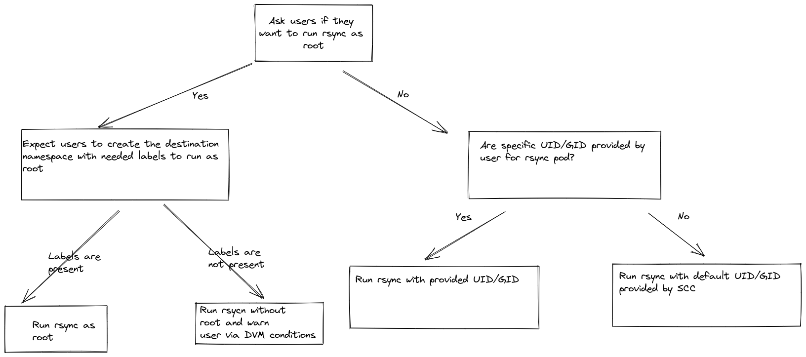

# Changes needed for MTC to continue working in 4.12 and onwards

With the incoming enforcement of [Pod Secutiry Admission](https://kubernetes.io/docs/concepts/security/pod-security-admission/) in 4.12 where by default pod would run with "restricted" profile, our workloads to migrate would violate this policy and no longer work as of now. There might be some changes that we might need to do in order to accommodate incoming change from 4.12.

## Related issues:
JIRA: https://issues.redhat.com/browse/MIG-1197

## Observed issues:

In 4.11 the default pod profile "restricted" is not enforced so as of now we are seeing warnings in odm must gather logs of our workloads such as mtc, discovery, color, plain, mig-ui, velero, restic, rsync, and stunnel being in violation of this new policy. And from 4.12 and onwards default "restricted" pod profile will be enforced, hence we will fail in 4.12.

## Related documents:
- [direct migration filesystem ownership](../direct-migration-filesystem-ownership/README.md)
- [crane-2.0 ownership change](../../crane-2.0/ownership-change/README.md)
- [PSA-enhancement](https://github.com/openshift/enhancements/blob/master/enhancements/authentication/pod-security-admission.md)
- [PSA-autolabeling](https://github.com/openshift/enhancements/blob/master/enhancements/authentication/pod-security-admission-autolabeling.md)

## Release Signoff Checklist

- [ ] Enhancement is `implementable`
- [ ] Design details are appropriately documented from clear requirements
- [ ] Test plan is defined
- [ ] User-facing documentation is created

## Summary

Currently, we are running our workloads with privileged profile by default and with upcoming enforcement in 4.12 where restricted profile will be by default, we will fail to submit any pods that are in violation. As stated above almost every container we have is currently in violation of the upcoming change. Hence, we need to make changes to keep working in 4.12 and onwards.

## Motivation

While testing MTC workloads in OpenShift 4.11 environment, we encountered warnings stating that our workloads are in violation of upcoming PSA changes. These changes will be enforced in 4.12, and we will face the same errors and fail to submit out pods, and we won't be able to run the workloads needed for MTC.

### Goals

1. Determine the changes that are needed to keep working in OpenShift 4.12 and onwards

## Proposal

The proposed solution includes two changes:
1. Adding required labels to `openshift-migration` namespace to allow the workloads within this namespace to run with privileged profile.
2. For the workloads running in user namespace such as `rsync` pods, we have two alternates and of which our proposed solution is to not run the pod in privileged mod and migrate files with default UID/GID provided by SCC, or we can ask for a specific UID/GID from the range that is allowed within migrating namespace and run rsync pod with that provided UID/GID. 

#### Adding required labels to openshift-migration namespace (solution for the workloads running within openshift-namespace)

The below labels can be added to `openshift-migraiton` namespace to enforce pod security profile, meaning workloads within the said namespace will be allowed to run with priviledged profile.
- `pod-security.kubernetes.io/enforce: privileged`
- `pod-security.kubernetes.io/audit: privileged`
- `pod-security.kubernetes.io/warn: privileged`


#### For the workloads running in user namespace

Rsync pods run outside of `openshift-migration` namespace (in user namespace) and need to run as root (with uid 0) to preserve UID/GID while migrating files. Running rsync pods as root with uid 0 will no longer be possible with default pod profile being `restricted` and without adding required labels to the user namespace to allow escalation to `priviledge`. Adding labels in user namespace is not reasonable. So now one of the possible way to tackle this situation is below.

##### Allow users to decide how to run rsync operations

Rsync pods need to run as root to preserve UID/GID of the migrating files. We can choose to run the rsync operation with `restricted` profile by default. In this case rsync pods will run with the UID/GID provided by SCC that are within the range of allowed IDs of migrating namespace, and the files would have the same UID/GID as rsync pod. We would also need to strip some capabilities from rsync pod to make sure it can be run with `restricted` profile.

```
capabilities:
  drop:
    - ALL
```

We can ask users to run rsync pod with specific UID/GID that is not root by setting SecurityContext of Rsync Containers:
```
securityContext:
  runAsUser: 1000680000
  runAsGroup: 1000680000
```
These UID/GID have to be within the allowed range so that we do not violate SCC or PSA. In order to allow custom values of UID/GID we might have to introduce some fields in DVM or migration CR.

We can ask if users want to preserve the UID/GID data and wants to run rsync pods as root via setting a field may be in DVM or migration. If they want to, then they would need to create the destination namespace with labels needed for root access in destination user namespace. By default, we do not add those labels in the destination namespace.

So the final approach could look something like this:



**Pros:**
- Easy to implement

**Cons:**
- Not preserving UID/GID of files that are getting migrated in case of non root and with default UID/GID provided by SCC.
- Migrating multiple namespaces and running rsync pod with user provided UID/GID can cause problems if UID/GID is valid for one namespace and not the other.

### Implementation Details

To implement the above proposal, the following changes are needed.

- Introducing the following fields in migration CR

```shell script
// MigMigrationSpec defines the desired state of MigMigration
type MigMigrationSpec struct {
	...
	// If set True, run rsync operations with escalated privileged, takes precedence over setting RunAsUser and RunAsGroup
	RunAsRoot *bool `json:"runasroot,omitempty"`
	
	// If set, runs rsync operations with provided user id. This provided user id should be a valid one that falls within the range of allowed UID of user namespace
	RunAsUser *int64 `json:"runasuser,omitempty"`

	// If set, runs rsync operations with provided group id. This provided user id should be a valid one that falls within the range of allowed GID of user namespace
	RunAsGroup *int64 `json:"runasgroup,omitempty"`
}
```

- Changing the way destination namespace and rsync pods are getting created
    - The default behavior is to run rsync with minimal capabilities and `restricted` SCC with default UID/GID.
    - If `RunAsRoot` is set true by the user, then check if the destination namespace has the needed labels to run the rsync pod as root. Run the migration as it would run as of now. If the labels are not present in the destination namespace, then run rsync without root and warn User about the same in DVM CR.
    - If `RunAsRoot` is not set and `RunAsUser` & `RunAsGroup` are provided then add this information to rsync pod definition to make sure rsync pod run with user provided UID/GID.
    
#### Need of running rsync with different profiles

Kubelet makes the decision of changing file ownership with `chown` per plugin. 

- For in-tree plugins:
    - Each plugin has a `SetUpAt()` function implemented which can call `volume.SetVolumeOwnership`, thus indicating kubelet to change permissions of the files. The example of such in-tree plugins are - `aws_ebs`, `vsphere_volume`, `portworx`, `configmap`, `secret`, `azuredd`, `rbd`, `iscsi`, `flexvolume`. Detailed list of all the plugins calling to `volume.SetVolumeOwnership` can be found [here](https://github.com/kubernetes/kubernetes/search?p=1&q=SetVolumeOwnership). 
    - The rest of the in-tree plugins such as `nfs`, `azure_file`, `cephfs` are examples of plugins that are not changing ownership since these plugins are not making a call to `volume.SetVolumeOwnership`.

- For CSI plugins:
    - Before K8s 1.19, OpenShift 4.5 or earlier:
        1. If `fstype` is "", then skip `fsgroup` (could be an indication of a non-block filesystem), and not change the permissions
        2. if `fstype` is provided and `pv.AccessMode == ReadWriteOnly` and `!c.spec.ReadOnly` then apply `fsgroup` and change the file permissions
    - At or after 1.19, OpenShift 4.6 and onward, `CSIDriver.Spec.FSGroupPolicy` is used by kubelet to decide on changing the ownership, which can have following possible values. More details on this can be found [here](https://github.com/kubernetes/enhancements/tree/master/keps/sig-storage/1682-csi-driver-skip-permission):          
         - `ReadWriteOnceWithFSType` --> Current behavior. Attempt to modify the volume ownership and permissions to the defined fsGroup when the volume is mounted if accessModes is RWO.
         - `None` --> New behavior. Attach the volume without attempting to modify volume ownership or permissions.
         - `File` --> New behavior. Always attempt to apply the defined fsGroup to modify volume ownership and permissions regardless of fstype or access mode.

[This doc](https://docs.google.com/document/d/12XbFpkMbMvBH1Vy3lk9e2-_pkIfCNODPkY_xbYti4Fo/edit) talks about how kubelet acts in response to different plugins in detail.

##### Making the decision of how to run rsync operations

If kubelet will change the permissions for volume, user should not care about running rsync with root or specific UID/GID. 

For the plugins for which kubelet won't change the permissions, user can choose to preserve permissions by running rsync with root, or change the permissions to specific UID/GID, or change permissions to default UID/GID provided by SCC.

## Design Details

### Upgrade / Downgrade Strategy

In the event of updating MTC with the changes from this enhancement, since these added fields are not required and we have a default behavior to run rsync with `restricted` profile, the plans that are already created should work as expected. While performing cluster upgrade (OpenShift 4.12 and onward), the MTC with the changes in this enhancement is required because of incoming enforcement of SCC and PSA changes.
   
## Alternatives

### Similar to restic

Alternative solution to not running rsync pod as root with uid 0 is to adapt something similar to how restic works right now. We can spin up a pod in user namespace to mount a PVC, and we can spin up rsync pod in `openshift-migration` namespace on the same node to access the volume via the node's volume mount.

**Pros**:
- UID/GID of the files migrated are getting preserved and there are no differences in terms of migration in direct and indirect migration.
  
**Cons**:
- Difficult to implement
- Changes current and proven design tremendously, might unearth some unknown edge cases 

