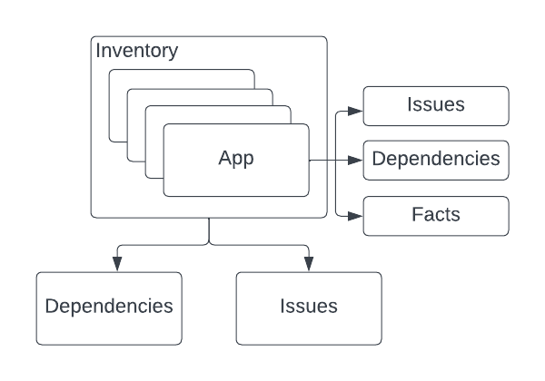

# Dynamic Reports

The results of source code and binary analysis are vital to assessment of applications. They enable users to define and plan appropriate migration strategies in the later stages of the Konveyor methodology. So far, Konveyor relies on Windup output to present the results of these analyses. It is largely static and isn't stored in Konveyor. It is limiting in that Konveyor cannot aggregate the analysis results for multiple applications in the inventory.

In this enhancement, we present Dynamic Reports. Dynamic Reports use the analysis data created by the new LSP analyzers. They can be generated on-demand for one or more applications from the most recent analysis data available in Konveyor. They enable users to see analysis information of multiple applications in one place with better control over what's displayed.

## Motivation

With the upcoming integration of new LSP analyzers in Konveyor, the data generated by analyzers becomes a first class entity in Konveyor. We talked about this in our previous enhancement on [Reporting Format](./TODO: Link here). It opens up lots of possibilities for Konveyor in terms of what it can do with the data. We want to leverage that and improve reporting capabilities of Konveyor. Dynamic reports are simply reports that give users much more control on what information is displayed via filters, visualizations, etc. They bring important information across all applications in the inventory in one place and make it easier for users to query that information.

### Goals

We only intend to define requirements and scope for dynamic reports.

### Non-Goals

We do not intend to discuss technical details in this enhancement. More enhancements will follow for technical details on implementation.

## Proposal

The three main components of the dynamic reports we are proposing are Issues, Dependencies and Facts. 

Issues and Dependencies are the primary components that will be aggregated over multiple applications, whereas Facts are specific information showed only in the context of a specific application. Note that the analyzers create data pertaining to all three components for one application at a time.

### Issues

An issue is analogous to a _Violation_ created by the analyzer. They are created when analyzer finds a match for a Rule.

Issues have following properties:

* Description: A text description in markdown format
* Rule ID: Rule for which the issue was created
* Category: Helps define severity of issue
* Effort: A numeric value denoting efforts needed to fix the issue
* Hyperlinks: External links that provide additional information pertaining to the issue
* Incidents: Occurrences of the issue across the source code. Each incident will have a file URI and a message that helps show information about that particular incident.

### Dependencies

Analyzers output dependencies for an application with each dependency having following properties:

* Name: Name of the dependency.
* Version: Version of the dependency.
* SHA: Checksum of the dependency.
* Indirect: Whether the dependency is indirect.
* Type: Type of the dependency.

### Facts

Facts are additional application specific data generated by the analyzers. Depending upon application technology, different analyzers (providers)
 will generate different type of data for an application. The application facts will be generated from this information. Examples of application facts for a Java application are:
 - Enterprise Java Beans reports
 - Java Persistent API usage reports
 - Spring Beans reports
 - Hibernate session usage

Facts are data that don't necessarily fit into the notion of "issues" or "dependencies". Since the data types for facts are arbitrary, we do not envision aggregating this data at the portfolio level. Facts will only be presented in the context of an application. Filtering / querying application facts will not be possible due to the nature of the data.

### User Stories

We define two scopes for the reports:

* Portfolio scope: This is the part of report which is in the context of all or a selected subset of applications in the inventory.

* Application scope: This is the part of report which is in the context of one specific application.

#### Portfolio scope

##### Dependencies

* As a user, I want to be able to see a list dependencies across all applications in the inventory.

* As a user, I want to be able to filter dependencies by applications and whether the dependency is a direct or an indirect dependency.

* As a user, I want to be able to see a list of dependencies shared by two or more applications in the inventory.

##### Issues

* As a user, I want to be able to see a list of all issues generated by the analyzer for all applications in the inventory.

* As a user, I want to be able to filter issues by applications, category, effort and source/target technologies. 

* As a user, I want to be able to use more than one filters at a time to further narrow down my search of issues.

##### Statistics

* As a user, I want to see total number of "mandatory" issues aggregated across all my applications from most recent analyses available.  

* As a user, I want to be able to see all categories of issues with their associated story points aggregated across all my applications from most recent analyses available.

* As a user, I want to be able to filter statistics generated from most recent analyses by applications.

* As a user, I want to be able to see trend of "mandatory" story points generated from the history of all analyses.

* As a user, I want to be able to see trend of number of issues in each category from the history of all analyses.

#### Application scope

##### Dependencies

* As a user, I want to be able to see a list of dependencies for a specific application.

* As a user, I want to be able to see a tree of dependencies so that I can distinguish between a direct and an indirect dependency.

* As a user, I want to be able to filter Java dependencies by package groups.

##### Issues

* As a user, I want to be able to see a list of issues for a specific application.

* As a user, I want to be able to filter the issues by their category and efforts.

* As a user, I want to be able to see breakdown of number of issues per category with associated story points for each category.

* As a user, I want to be able to see breakdown of "mandatory" issues by effort with associated story points for each level of effort.

* As a user, I want to be able to see number of issues generated per Java package.

###### Facts

* As a user, I want to be able to see all tags generated for the application including categories of tags created.

* As a user, I want to be able to filter tags by categories (tag types).

* As a user, I want to be able to see Enterprise Java Beans in an application.

* As a user, I want to be able to see Java Persistence API usage with details including persistent units, entities and queries.

* As a user, I want to be able to see a list of Spring Beans in an application with details including Bean Name and Class.

* As a user, I want to be able to see Hibernate session factories and entities in an application.

### Implementation Details/Notes/Constraints

#### Multiple Filters

One or more filters can be combined together to form complex searches. When using multiple filters, logical AND will be implied. In the future, we can probably expand the scope to have logical ORs in the filters. But right now, it's out of scope. We do not intend to support advanced operations like ANY, IN, etc.

#### Filter dependencies by Java package groups

From analyzers perspective, Name field of a dependency would have fully qualified name for the dependency. It makes the most sense to have a generic "Name" field to accomodate all different kinds of dependencies out there for different technologies. As a result, implementing a filter based on Java package group names implies a full text search within names of dependencies. 

#### Historical data

Contents of the dynamic report are generated from most recent analysis data except for "trends". For trends, we want to store the computed statistics of the analyses and not the entire output. We want to limit the data points we store. But we are not defining a limit on the period of time for which the data stays.
