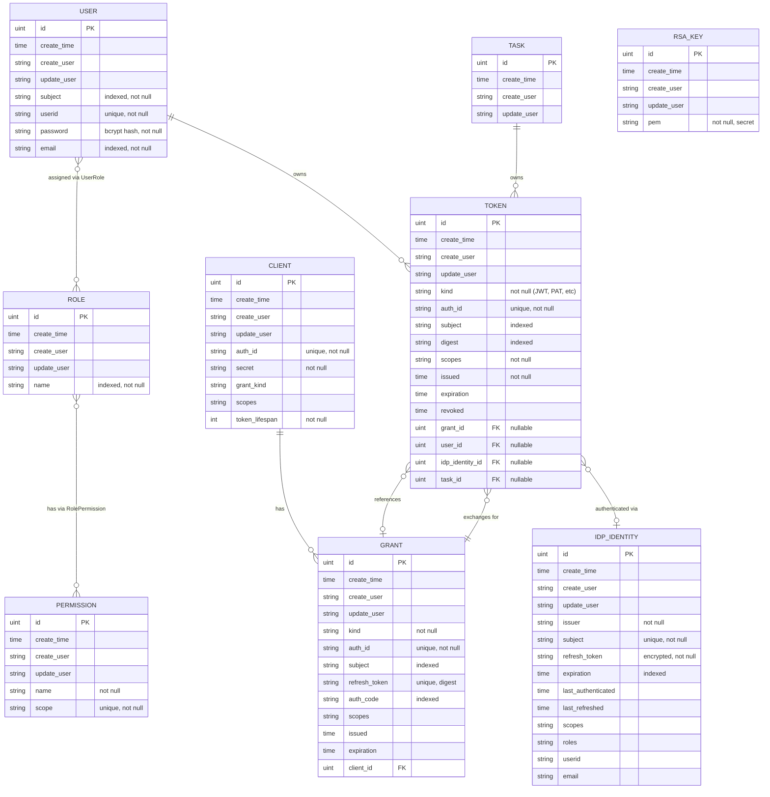
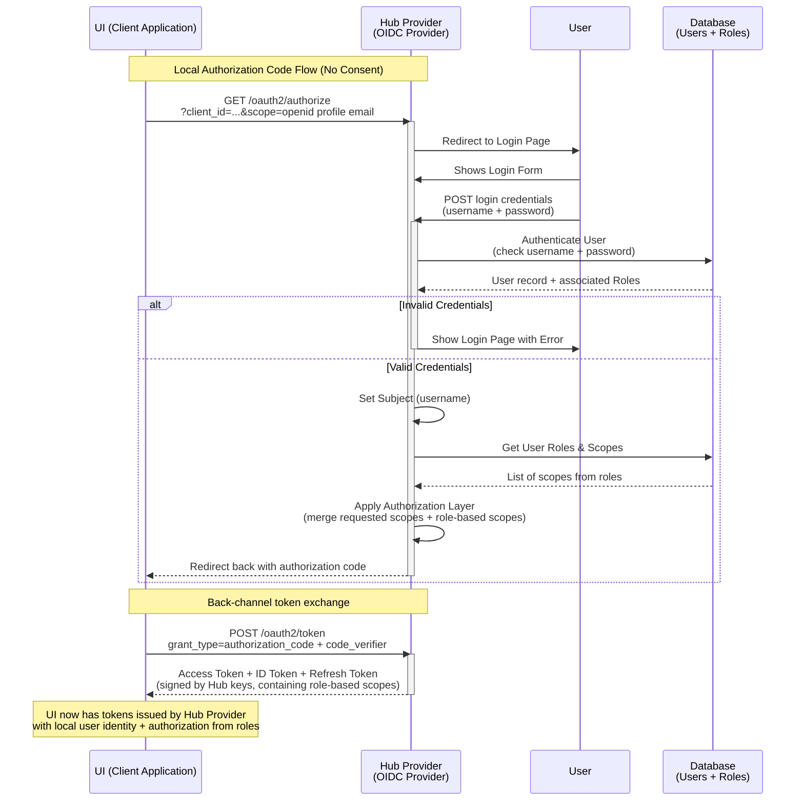
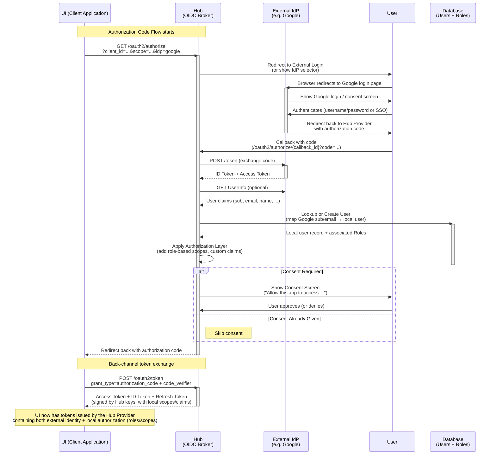
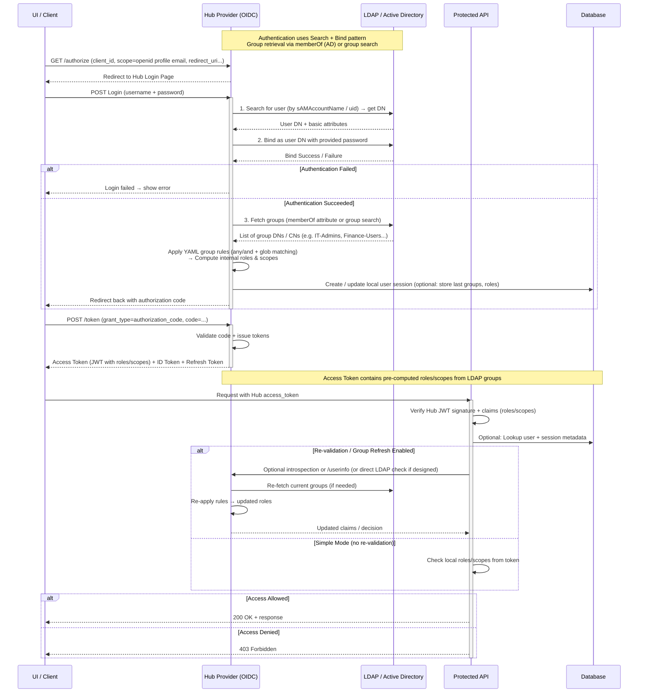
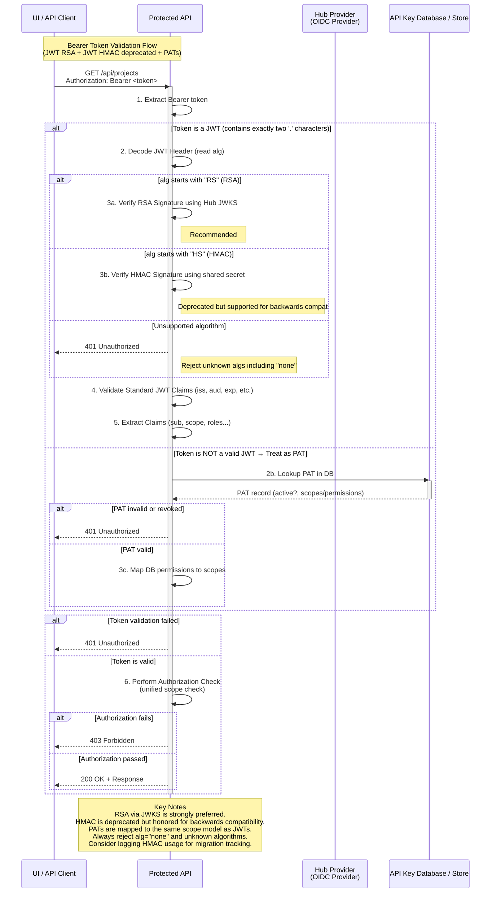
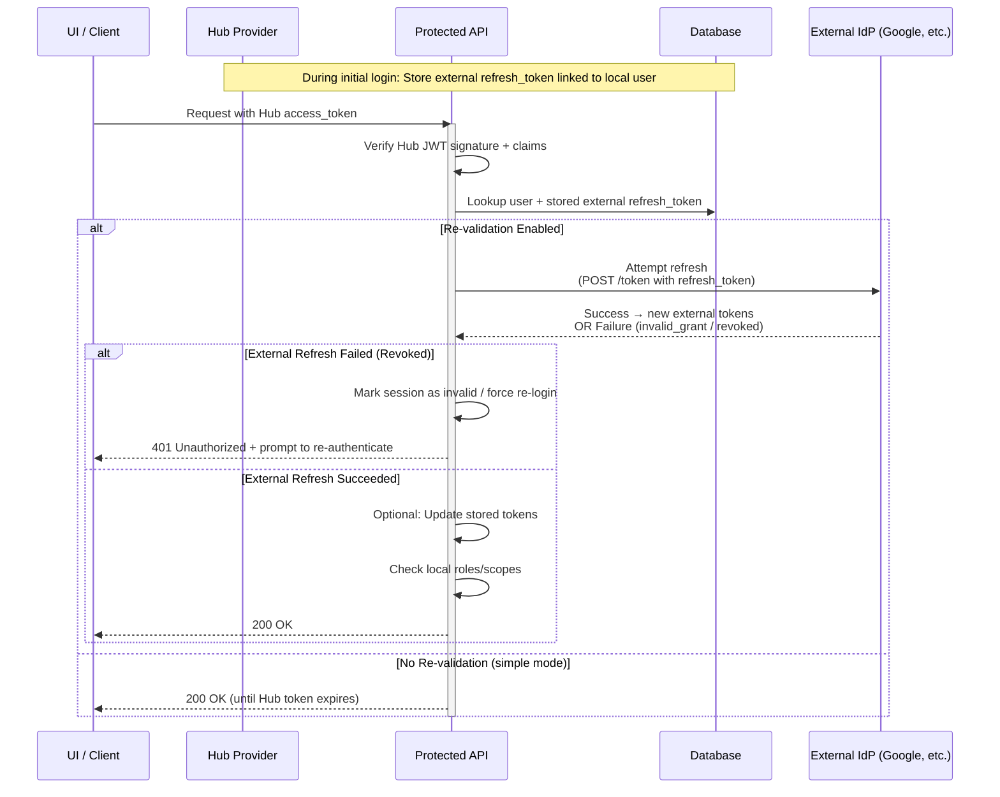

# Design Details: Builtin Auth

This document contains the detailed design specifications for the builtin Auth enhancement.

## Architecture Overview

The Hub will function as an OIDC provider with the following components:
- User and role-based access control (RBAC) managed in the Hub inventory
- Support for local authentication or delegation to external providers (OIDC, LDAP/Active Directory)
- Personal Access Token (PAT) based authentication for programmatic access
- Token issuance, validation, and revocation

## Routes and Endpoints

### Resource Management Endpoints

| Method                | Path                 | Purpose                                                  |
|-----------------------|----------------------|----------------------------------------------------------|
| ANY                   | /auth/users          | User collection                                          |
| ANY                   | /auth/roles          | Roles collection                                         |
| GET                   | /auth/permissions    | Permission collection                                    |
| POST \| GET \| DELETE | /auth/tokens         | PAT management (requires authentication)                 |
| GET                   | /auth/idp/identities | Remote IDP identity collection                           |


### Standard OIDC Endpoints

| Method | Path                              | Purpose                                                                                        |
|--------|-----------------------------------|------------------------------------------------------------------------------------------------|
| GET    | /.well-known/openid-configuration | Discovery document – Tells clients all the endpoints, supported scopes, grant types, etc.      |
| GET    | /oidc/authorize                   | Authorization Endpoint – Starts the login flow (shows login form or redirects to external IdP) |
| POST   | /oidc/token                       | Token Endpoint – Exchanges authorization code for access_token + id_token + refresh_token      |
| GET    | /oidc/jwks                        | JSON Web Key Set – Public keys used by clients to verify your JWT signatures                   |
| GET    | /oidc/userinfo                    | UserInfo Endpoint – Returns user claims (optional, but commonly used)                          |
| POST   | /oidc/introspect                  | Token Introspection – Allows resource servers to validate opaque tokens (optional)             |
| POST   | /oidc/revoke                      | Token Revocation – Allows clients to revoke refresh tokens (optional but recommended)          |

## Data Model

### Entity Definitions

**Entities:**
- **User** - Known users in the system
- **Role** - Named groups of permissions (scopes)
- **Permission** - Named permissions mapped to scopes
- **IdpIdentity** - Identities authenticated by remote IdP provider. Contains the refresh token.
- **Client** - OIDC client registrations
- **Grant** - OIDC authorization grants (authorization codes and refresh tokens)
- **Token** - Issued tokens (JWTs, PATs, and other token types differentiated by Kind field)
- **RsaKey** - RSA signing keys for JWT tokens

### Entity Relationship Diagram



### Implementation Notes

- The Token table is unified and contains all token types (JWTs, PATs, etc.) differentiated by the `kind` field
- The Token.expiration column is mainly used for reaping expired tokens
- The Token.digest column stores hashed tokens for lookup (PATs and refresh tokens)
- The Grant table stores OIDC authorization grants, including authorization codes and refresh token metadata
- Client registrations are stored in the Client table
- RSA signing keys are stored in the RsaKey table

## Authentication Flows

### Local Authentication Flow

The standard OIDC authorization code flow with local credential verification:



### External OIDC Provider Flow

When an external OIDC provider (e.g., Google, Keycloak) is configured, the Hub acts as a broker:



### LDAP / Active Directory Flow

LDAP authentication uses the search + bind pattern with group-based role mapping:



## Token Validation

### Standard Token Validation Flow

Supports JWT (RSA and deprecated HMAC) and API keys:



### External IdP Token Validation

For users authenticated via external providers, validation includes refresh token checks:



## Personal Access Token (PAT) Authentication

### Generation

PATs are generated via authenticated POST to `/auth/tokens`. The user must already be
authenticated and present a valid access token (e.g., from OIDC login). The PAT inherits
permissions from the authenticated user's roles.

**Request:**
```http
POST /auth/tokens
Authorization: Bearer <access_token>
Content-Type: application/json

{
  "lifespan": 720,     // OPTIONAL (hours)
  "expiration": "..."  // OPTIONAL (datetime)
}
```

**Response:**
```json
{
  "id": 18,
  "token": "cvP1sjff7_X2dCEIzUPf8f0IzKSbwiSDf1dZChZuRxY",
  "expiration": "..."  // OPTIONAL
}
```

**Implementation details:**
- Requires valid authentication - user must present an access token
- PATs are 256-bit HEX strings
- PATs are stored in the Token table with `kind = "PAT"` as a hashed digest in the `digest` field
- Permissions (scopes) are inherited from the authenticated user's role assignments and stored in the `scopes` field
- PATs can have optional expiration dates

### Authentication

PATs are presented as Bearer tokens:
```
Authorization: Bearer <token>
```

**Validation process:**
1. Extract the token from the Authorization header
2. Hash and lookup the token in the Token table by digest
3. Verify the token is not expired (check `expiration` field) or revoked (check `revoked` timestamp)
4. Retrieve associated permissions from the `scopes` field
5. Authorize endpoint access based on scopes

### Addon Tokens

The task manager and addon API authorization will be refactored to use PATs instead of custom JWT
token generation:
- New tasks will be configured with PATs for authentication
- Legacy support: Tokens with `SigningMethod=HMAC` will still be honored for backwards
  compatibility with in-flight tasks
- This provides a unified authentication mechanism across all programmatic access

## LDAP/Active Directory Group Mapping

### Policy Schema

The group-to-role mapping policy is expressed in YAML and can be managed through the UI. The policy defines how LDAP/AD 
group memberships map to internal roles.

**Structure:**
- Each mapping rule contains a conditional expression (`any` or `and`) and a list of `roles` to assign
- **`any`**: User matches if they belong to **at least one** of the listed groups (logical OR)
- **`and`**: User matches if they belong to **all** of the listed groups (logical AND)
- **`roles`**: List of internal role names to assign when the condition matches

**Evaluation rules:**
- All rules are evaluated for each user during authentication
- A user may match multiple rules and accumulate roles from all matches
- The final set of permissions (scopes) is the union of all assigned roles
- Group names are matched exactly (case-sensitive) against groups returned from LDAP/AD

### Example Policy

```yaml
groups:
  # Administrators
  - any:
      - Engineering-Admins
      - Platform-Admins
      - IT-Admins
      - SEC-Global-Admins
      - Infrastructure-Admins
    roles:
      - admin

  # Managers
  - and:
      - Engineering
      - Engineering-Managers
      - Managers
    roles:
      - manager

  # Architects
  - any:
      - Engineering-Architects
      - Principal-Architects
      - Solution-Architects
      - Tech-Leads
    roles:
      - architect

  # Migrators
  - any:
      - Engineering-Migration-Team
      - Database-Admins
      - SRE-Migration
      - Platform-Migration
      - Data-Migration-Team
    roles:
      - migrator

  # High-privilege production access
  - and:
      - Engineering
      - Prod-Admins
    roles:
      - admin
      - migrator
```

## Token Revocation

Tokens and grants can be explicitly revoked:

- **DELETE /auth/grants/:id** - Revokes a specific OIDC grant (effective on next refresh)
- **DELETE /auth/tokens/:id** - Revokes a specific (PAT) token (effective immediately)

Revocation is tracked in the database via the Token.revoked timestamp field to ensure revoked
credentials are not accepted.

## Configuration Management

### OIDC Configuration

All OIDC-related configuration is loaded from a single Secret (`hub-oidc`) seeded by the operator.
This Secret contains:

- **Client registrations** (`clients:` section): Registered OIDC clients (UI, CLI tools, etc.)
  with their credentials, redirect URIs, and allowed scopes
- **External IdP configurations** (`idp:` section): External identity provider configurations
  (Keycloak, Google, LDAP, etc.) with connection details and credentials

This unified approach allows the operator to manage all OIDC configuration atomically without
requiring database access. The Secret is mounted into the Hub at `/etc/hub/` and read at startup
(file: `/etc/hub/oidc.yaml`).

#### Hub

Example structure:
```yaml
apiVersion: v1
kind: Secret
metadata:
  name: hub-oidc
type: Opaque
stringData:
  oidc.yaml: |
    clients:
      - clientId: web-ui
        clientSecret: <secret>
        grants:
        - authorization_code
        - refresh_token
        redirectURIs:
        - localhost:8080                               # web-app
        - https://keycloak.example.com/realms/konveyor # (optional) federated oidc
        scopes: [...]
      - clientId: kai-ide
        grants:
        - authorization_code
        - refresh_token
        redirectURIs:
        - vscode://publisher.extension/auth
        - https://keycloak.example.com/realms/konveyor # (optional) federated oidc
        scopes: [...]
      - clientId: cli
        grants:
        - urn:ietf:params:oauth:grant-type:device_code
        - authorization_code
        - refresh_token
        redirectURIs:
        - http://localhost:*  # unused for DAC (device access grant)
        scopes: [...]

    idp:
      - kind: oidc
        name: keycloak
        issuer: "https://keycloak.example.com/realms/konveyor"
        clientId: "tackle-hub"
        clientSecret: "<secret>"
        scopes: [...]
```

#### Clients

**WEB-UI:**

| setting       | value                               |
|---------------|-------------------------------------|
| issuer        | hub-service-address/oidc            |
| client_id     | web-ui                              |
| client_secret | ABCDE                               |
| redirect_uris | http://localhost:*                  |
| scope         | openid profile email offline_access |

**IDE:**

| setting       | value                               |
|---------------|-------------------------------------|
| issuer        | https://konveyor-ingress/hub/oidc   |
| client_id     | web-ui                              |
| redirect_uris | vscode://publisher.extension/auth   |
| scope         | openid profile email offline_access |
| response_type | code                                |
| usePKCE       | true                                |

**CLI (binding):**

| setting   | value                    |
|-----------|--------------------------|
| issuerURL | hub-service-address/oidc |
| clientID  | cli                      |


### Login UI

The login page UI fragment is read from a file selected by build tooling. This enables:
- Branding customizations managed by the operator
- Consistent UI updates across installations
- Separation of presentation from application logic

### Security

All sensitive information is stored securely in the database: passwords as bcrypt hashes, refresh
tokens encrypted. PATs are stored as cryptographic hashes (digests) only, never in plain text.
