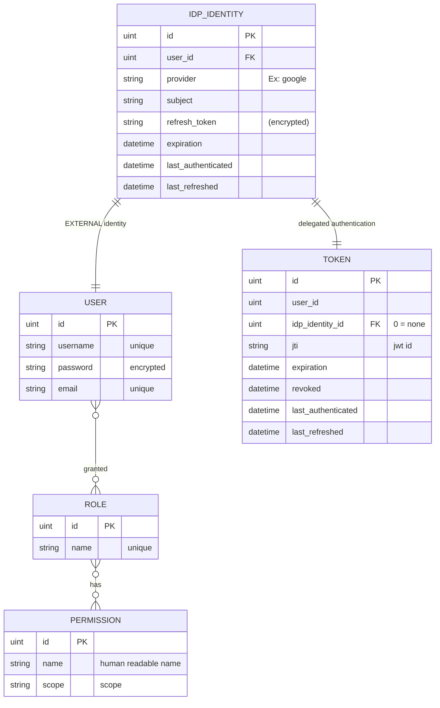
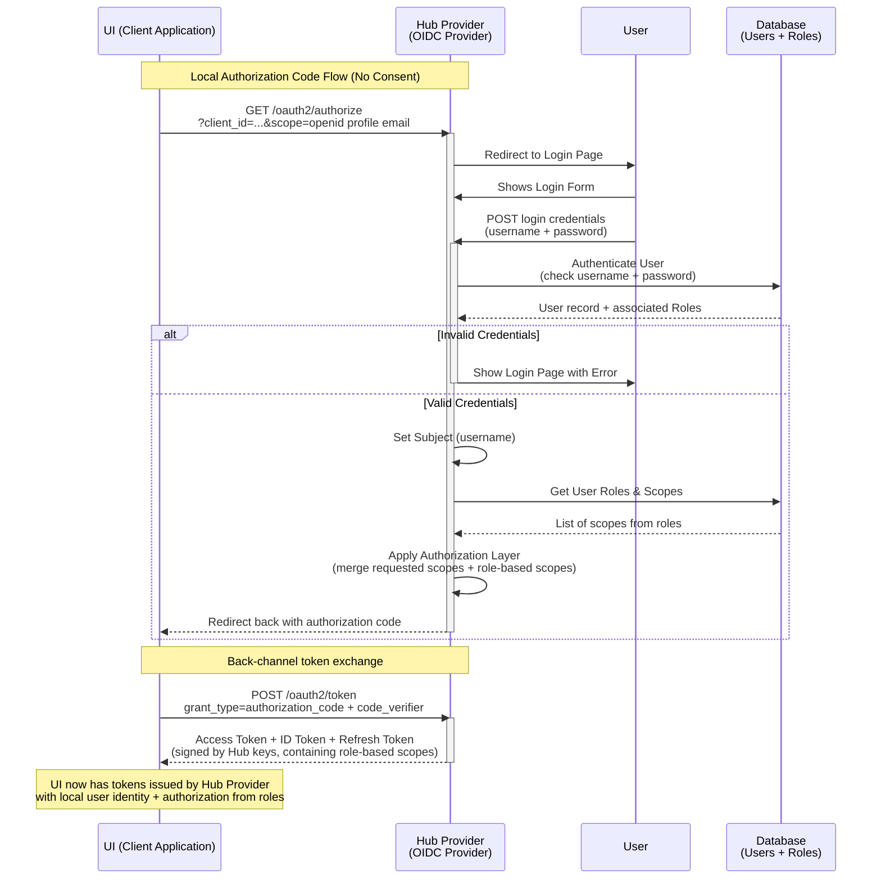
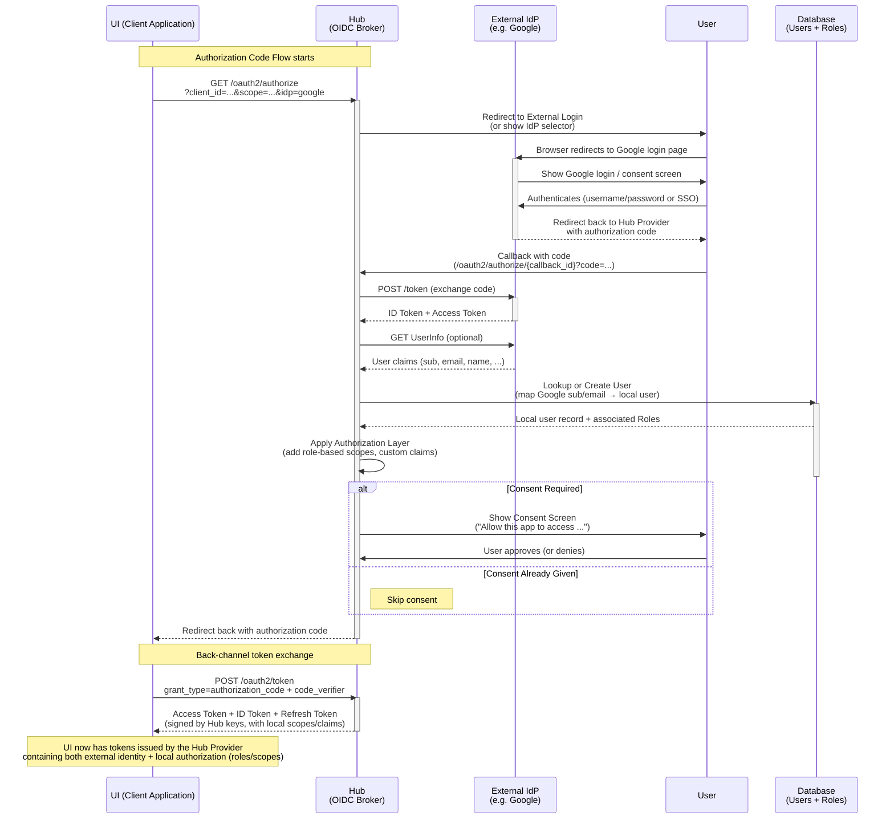
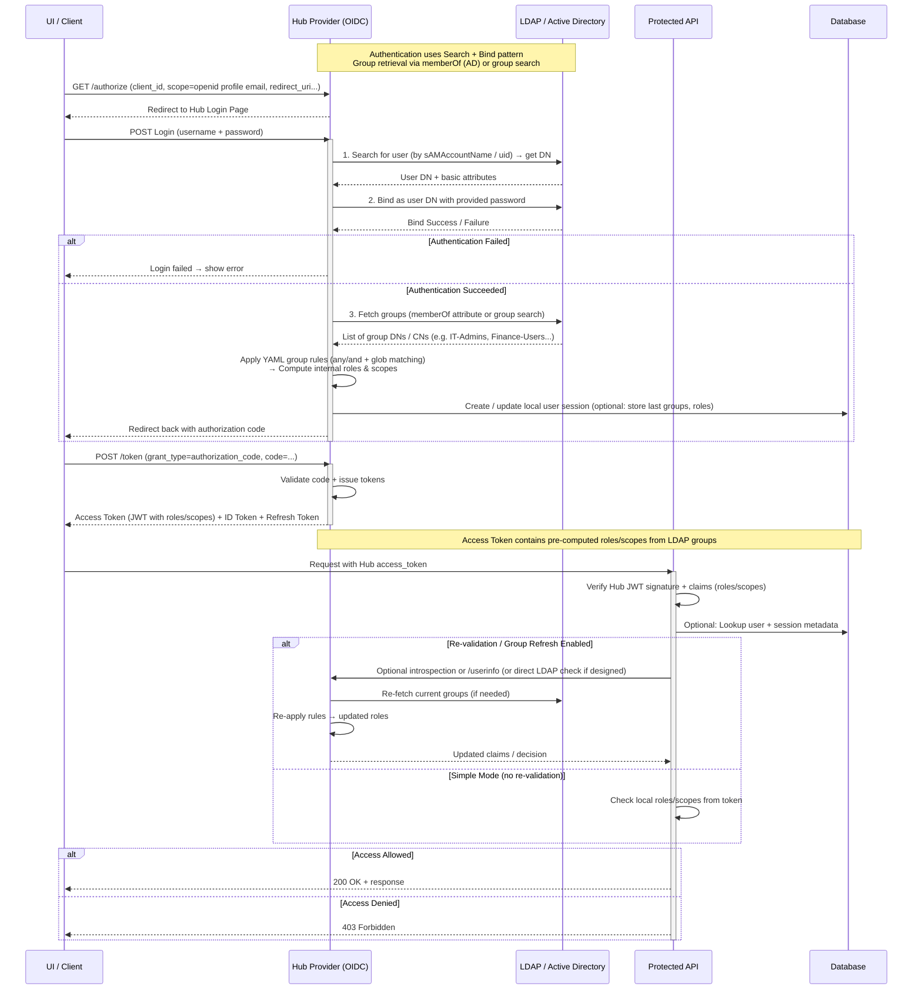
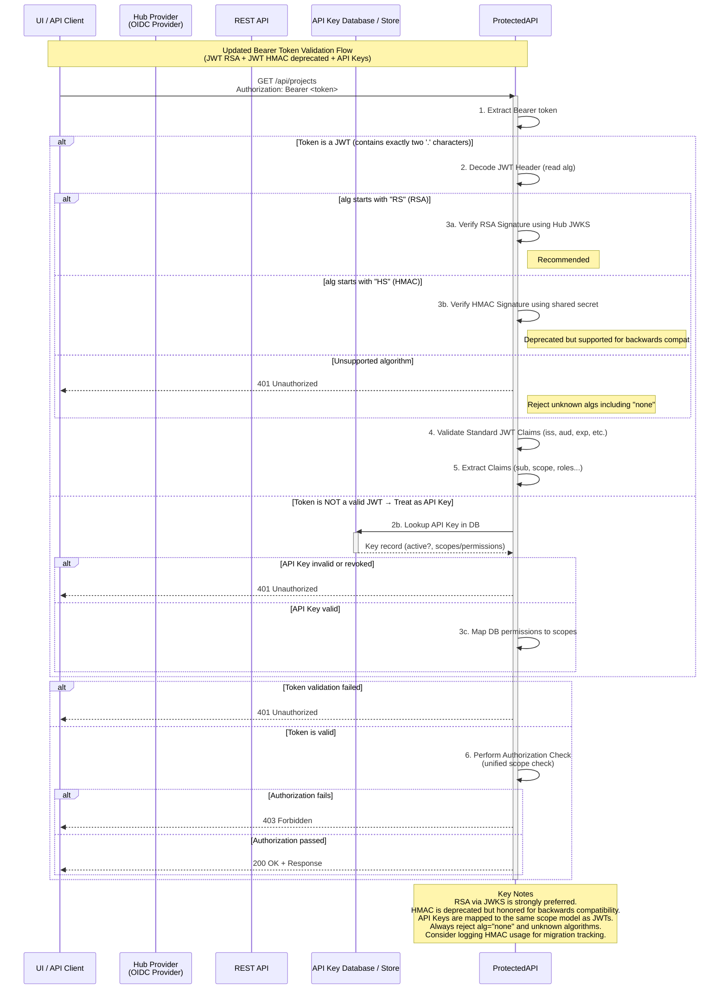
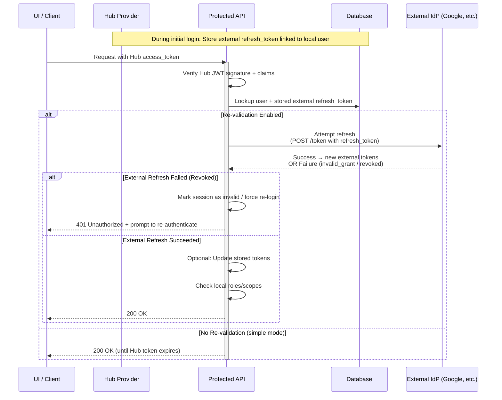

# Provide builtin Auth

Add builtin AuthN and AuthZ functionality so that KeyCloak is no longer required.


## Release Signoff Checklist

- [ ] Enhancement is `implementable`
- [ ] Design details are appropriately documented from clear requirements
- [ ] Test plan is defined
- [ ] User-facing documentation is created

## Open Questions

- What kinds of authentication options needed to query LDAP.

## Summary

Currently, keycloak is required to provide user authentication and authorization. Both the Hub
and the UI integrate with Keycloak using keycloak clients. The goal convert to OIDC (OpenID)
for AuthZ integration and remove the dependence on keycloak.  Further, to provide an
internal OIDC provider with optional delegation to an external OIDC provider (such as Keycloak
but can be anything).

## Motivation

Eliminate dependence on Keycloak.

### Goals

- **To discontinue dependence on keycloak**.
- To discontinue seeding the realm in keycloak.
- To provide OIDC-based Auth _out-of-the-box_.
- To delegate AuthN, AuthZ to an _external_ OIDC provider. (option)
- To delegate AuthN, AuthZ to an _external_ LDAP, Active Directory with group mapping. (option)
- To provide RBAC (users, roles, permissions) management in the inventory.
- To provide for API-Key authentication.  An API-Key is a generated secret used for application integration.

### Non-Goals

## Proposal

### OIDC

Make the hub an OIDC provider. The security policy may be self-contained or configured
to delegate authentication and/or authorization to an external provider. The hub inventory
is augmented to include Users and Roles. Users may be associated to roles and roles may
be associated to permissions (scopes).

The UI will be updated to use OIDC (instead of keycloak) and be configured to use the
hub OIDC provider.  The UI will have pages to manage user, roles and permissions.

The UI fragment used for the login page will be read from a ConfigMap managed by the operator.  Branding
customizations will be handled by the operator.

The hub may be configured to integrate with external (remote) auth providers. The primary mechanism will be OIDC but will
also support LDAP/ActiveDirectory.  In both cases, scopes (OIDC) and groups (LDAP) may need to be mapped to tackle roles. External
providers may be created, updated and deleted using the UI/API. Configuration includes connection information
credentials and group:role mapping rules. 

Publish a README.md that contains expected roles and a catalog of scopes to support user's bringing their
own external OIDC provider. This _may_ also include a recommended keycloak Realm specification.

All sensitive information will be stored encrypted.

Access tokens may be revoked (effective next refresh).

### API-Key

Add support for API-Keys (Reference [RFE-266](https://github.com/konveyor/enhancements/issues/266)).

#### Generation
POST /auth/apikey returns a 256-bit base64-encoded generated key which has been stored in the DB along with associated
permissions (scopes).

#### Revocation

DELETE /auth/apikey/:key

#### Authentication

HTTP requests with header: Authentication: Bearer `<key>` is detected and validated:
1. Find/match stored key.
2. Get mapped permissions (scopes).
3. Authorize endpoint access.

#### Addon tokens

Refit task manager and addon API authorization to use API-Key instead of custom JWT token generation.
For backwards compatibility, Tokens with SigningMethod=HMAC still honored to support in-flight tasks
with these tokens.  However, new tasks will be configured to present API-Keys.


### Security, Risks, and Mitigations

The [go-oidc](https://github.com/luikyv/go-oidc) package is **OpenID certified** and is actively maintained. It has no reported CVEs.  AI code analysis
reports no vulnerabilities or backdoors.

## Design Details

### Routes/Endpoints

Standard OIDC endpoints Provided by `go-oidc`

| Method | Endpoint Path                       | Purpose |
|--------|-------------------------------------|---------|
| GET    | `/.well-known/openid-configuration` | Discovery document – Tells clients all the endpoints, supported scopes, grant types, etc. |
| GET    | `/oidc/authorize`                   | Authorization Endpoint – Starts the login flow (shows login form or redirects to external IdP) |
| POST   | `/oidc/token`                       | Token Endpoint – Exchanges authorization code for access_token + id_token + refresh_token |
| GET    | `/oidc/jwks`                        | JSON Web Key Set – Public keys used by clients to verify your JWT signatures |
| GET    | `/oidc/userinfo`                    | UserInfo Endpoint – Returns user claims (optional, but commonly used) |
| POST   | `/oidc/introspect`                  | Token Introspection – Allows resource servers to validate opaque tokens (optional) |
| POST   | `/oidc/revoke`                      | Token Revocation – Allows clients to revoke refresh tokens (optional but recommended) |

### High Level Model:



#### Notes:
- The Token table contains hub issued tokens.
- The _expiration_ column is mainly used for reaping.

### Login



### Login (external Idp)

when and external provider is configured, the login page rendered by the hub will contain a
button for this.  For example: "Login with Google".



### Login (LDAP | Activity Directory)

TLDR:
- ODDC (started)
- Query user using service account.
- Bind as user. (authentication)
- Query for group membership.
- Map groups to roles (and then scopes)
- OIDC (continued).




### Token Validation



### Token validation (external Idp)



#### Policy

The role mapping policy can be expressed and edit by the UI as simple YAML.

```yaml
groups:
  # Administrators
  - any:
      - Engineering-Admins
      - Platform-Admins
      - IT-Admins
      - SEC-Global-Admins
      - Infrastructure-Admins
    roles:
      - admin

  # Managers
  - and:
      - Engineering
      - Engineering-Managers
      - Managers
    roles:
      - manager

  # Architects
  - any:
      - Engineering-Architects
      - Principal-Architects
      - Solution-Architects
      - Tech-Leads
    roles:
      - architect

  # Migrators
  - any:
      - Engineering-Migration-Team
      - Database-Admins
      - SRE-Migration
      - Platform-Migration
      - Data-Migration-Team
    roles:
      - migrator

  # High-privilege production access
  - and:
      - Engineering
      - Prod-Admins
    roles:
      - admin
      - migrator
```


### Test Plan

- Add hub binding tests for User, Role resources.
- Add authz tests using OIDC client.
- TBD

### Upgrade / Downgrade Strategy

