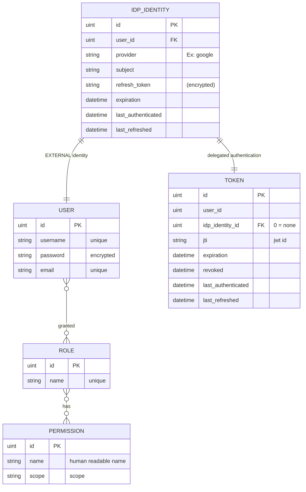
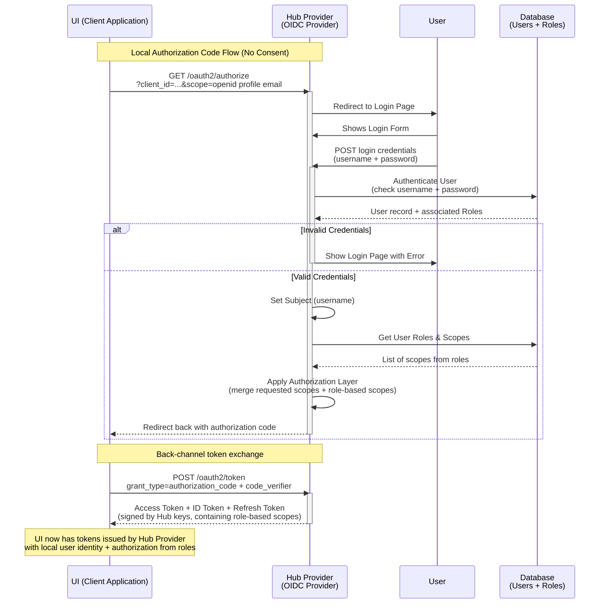
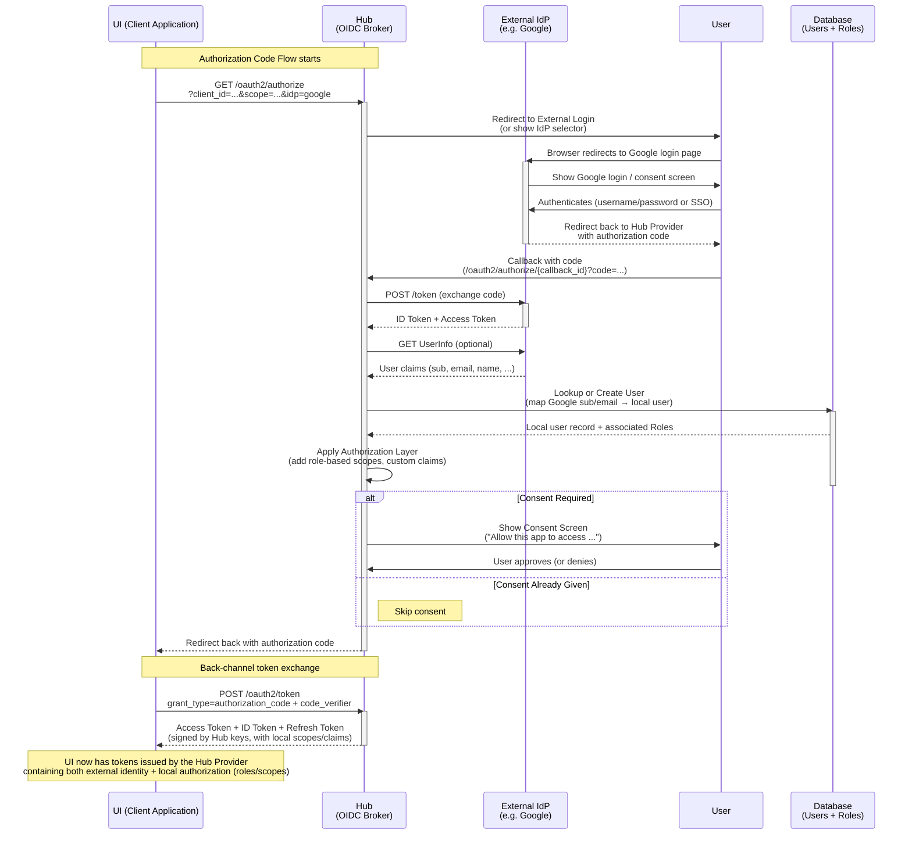
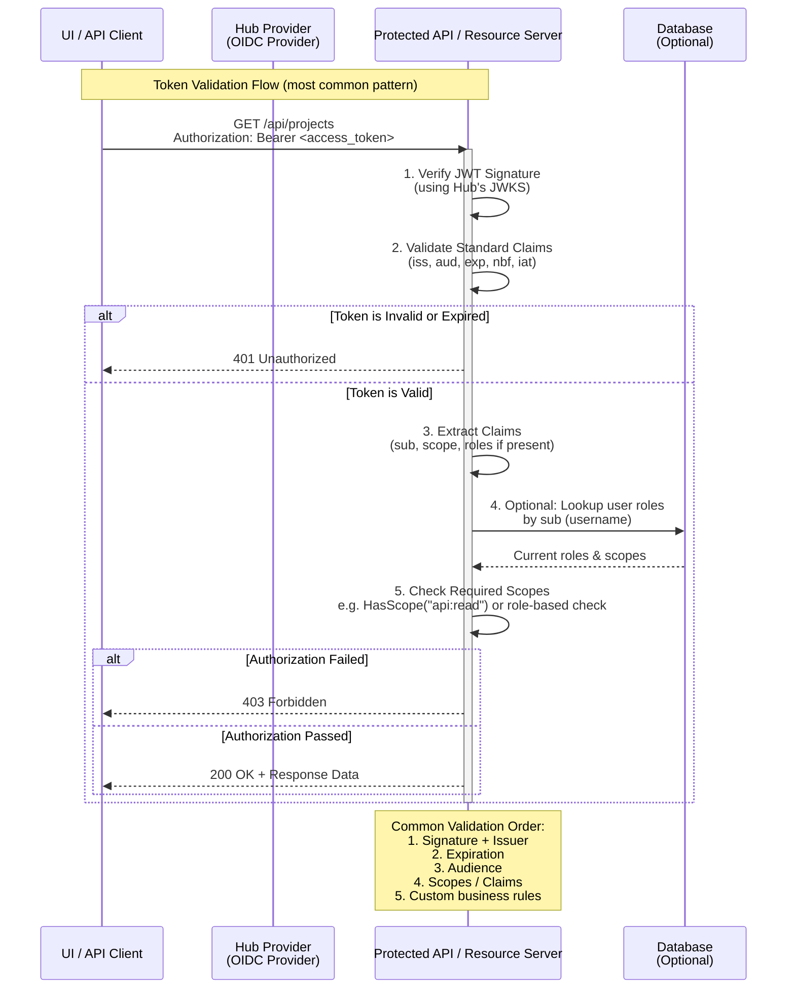
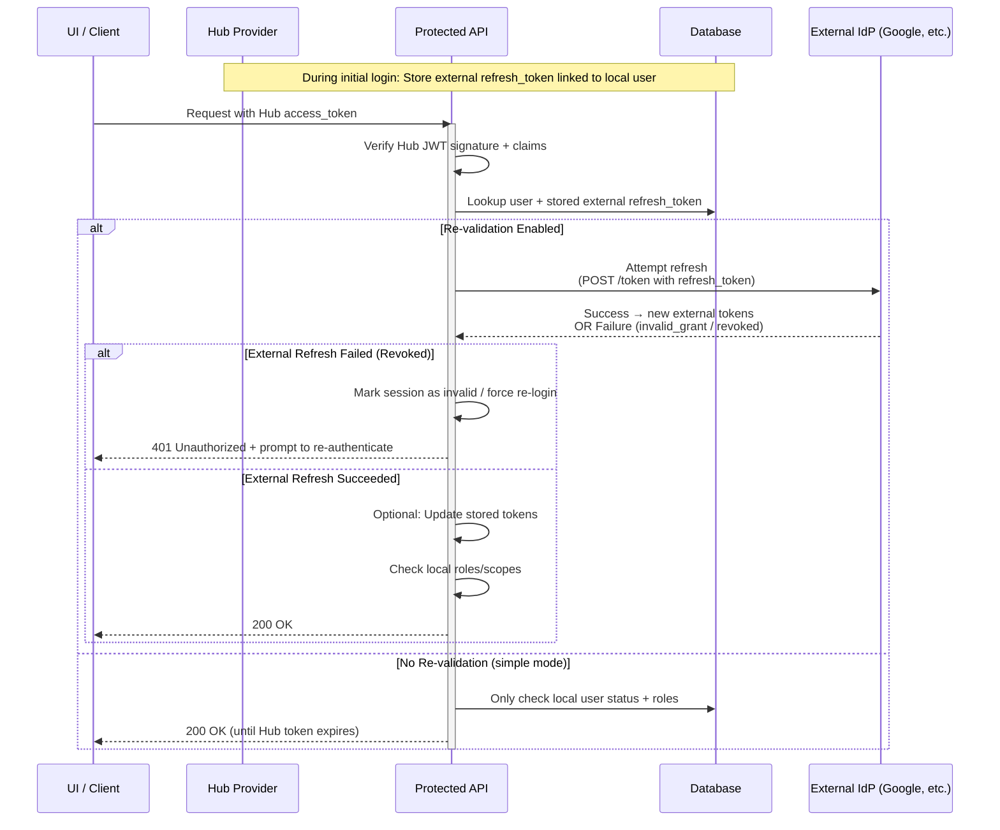

# Provide builtin AuthZ

Add builtin AuthZ functionality so that KeyCloak is no longer required.

## Release Signoff Checklist

- [ ] Enhancement is `implementable`
- [ ] Design details are appropriately documented from clear requirements
- [ ] Test plan is defined
- [ ] User-facing documentation is created

## Open Questions

## Summary

Currently, keycloak is required to provide user authentication and authorization. Both the Hub
and the UI integrate with Keycloak using keycloak clients. The goal convert to OIDC (OpenID)
for AuthZ integration and remove the dependence on keycloak.  Further, to provide an
internal OIDC provider with optional delegation to an external OIDC provider (such as Keycloak
but can be anything).

## Motivation

Eliminate dependence on Keycloak.

### Goals

- **To discontinue dependence on keycloak**.
- To provide AuthZ _out-of-the-box_.
- To (optionally) delegate authentication to an external OIDC provider
- To (optionally) delegate authorization to an external OIDC provider.
- To discontinue seeding the realm in keycloak.
- To support user management in the tackle UI.
  - User CRUD.
  - Role CRUD with association scopes.
  - Grant roles to users.

### Non-Goals

## Proposal

Make the hub an OIDC provider. The security policy may be self-contained or configured
to delegate authentication and/or authorization to an external provider. The hub inventory
is augmented to include Users and Roles. Users may be associated to roles and roles may
be associated to permissions (scopes).

The UI will be updated to use OIDC (instead of keycloak) and be configured to use the
hub OIDC provider.  The UI will have pages to manage user, roles and permissions.

The Tackle CR will support configuring the hub to use an external OIDC provider but it will no longer install,
configure or seed it.  The installation and configuration of an external provider is the sole responsibility 
of the user.

The UI fragment used for the login page will be read from a ConfigMap managed by the operator.  Branding
customizations will be handled by the operator.

Publish a README.md that contains expected roles and a catalog of scopes to support user's bringing their
own external OIDC provider. This _may_ also include a recommended keycloak Realm specification.

### Security, Risks, and Mitigations

The [go-oidc](https://github.com/luikyv/go-oidc) package is **OpenID certified** and is actively maintained. It has no reported CVEs.  AI code analysis
reports no vulnerabilities or backdoors.

## Design Details

### Routes/Endpoints

Standard OIDC endpoints Provided by `go-oidc`

| Method | Endpoint Path                       | Purpose |
|--------|-------------------------------------|---------|
| GET    | `/.well-known/openid-configuration` | Discovery document – Tells clients all the endpoints, supported scopes, grant types, etc. |
| GET    | `/oauth2/authorize`                 | Authorization Endpoint – Starts the login flow (shows login form or redirects to external IdP) |
| POST   | `/oauth2/token`                     | Token Endpoint – Exchanges authorization code for access_token + id_token + refresh_token |
| GET    | `/oauth2/jwks`                      | JSON Web Key Set – Public keys used by clients to verify your JWT signatures |
| GET    | `/oauth2/userinfo`                  | UserInfo Endpoint – Returns user claims (optional, but commonly used) |
| POST   | `/oauth2/introspect`                | Token Introspection – Allows resource servers to validate opaque tokens (optional) |
| POST   | `/oauth2/revoke`                    | Token Revocation – Allows clients to revoke refresh tokens (optional but recommended) |

### High Level Model:

#### Notes:
- The Token table contains hub issued tokens.
- The _expiration_ column is mainly used for reaping.

### Login

### Login (external Authentication)

when and external provider is configured, the login page rendered by the hub will contain a
button for this.  For example: "Login with Google".

### Token Validation

### Token validation (external authentication)

### Test Plan

- Add hub binding tests for User, Role resources.
- Add authz tests using OIDC client.
- TBD

### Upgrade / Downgrade Strategy

