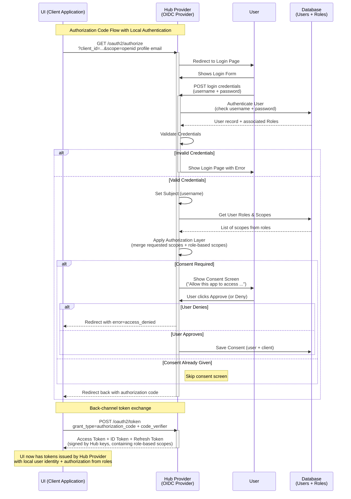

# Builtin AuthZ

Add builtin AuthZ functionality so that KeyCloak is no longer required.

## Release Signoff Checklist

- [ ] Enhancement is `implementable`
- [ ] Design details are appropriately documented from clear requirements
- [ ] Test plan is defined
- [ ] User-facing documentation is created

## Open Questions

## Summary

Currently, keycloak is required to provide user authentication and authorization. Both the Hub
and the UI integrate with Keycloak using keycloak clients. The goal convert to OIDC (OpenID)
for AuthZ integration and remove the dependence on keycloak.  Further, to provide an
internal OIDC provider with optional delegation to an external OIDC provider (such as Keycloak
but can be anything).

## Motivation

Eliminate dependence on Keycloak.

### Goals

- To provide AuthZ _out-of-the-box_.
- To (optionally) delegate authentication to an external OIDC provider
- To (optionally) delegate authorization to an external OIDC provider.
- To discontinue dependence on keycloak.
- To discontinue seeding the realm in keycloak.
- To support user management in the tackle UI.
  - User CRUD.
  - Role CRUD
  - User role assignment.

### Non-Goals

## Proposal

Make the hub an OIDC provider. The provider policy may be self-contained or configured
to delegate authentication and/or authorization to an external provider. Th hub inventory
is augmented to include Users and Roles. Users may be associated to roles and roles may
be associated to permissions (scopes).  Tokens will continue to contain scope claims.

When and external provider is configured, the login page rendered by the hub will contain a
button for this.  For example: "Login with Google".

The UI will be updated to use OIDC (instead of keycloak) and be configured to use the
hub OIDC provider.  The UI will have pages to manage user, roles and permissions.

### User Stories [optional]

Detail the things that people will be able to do if this is implemented.
Include as much detail as possible so that people can understand the "how" of
the system. The goal here is to make this feel real for users without getting
bogged down.

#### Story 1

#### Story 2

### Implementation Details/Notes/Constraints [optional]

What are the caveats to the implementation? What are some important details that
didn't come across above. Go in to as much detail as necessary here. This might
be a good place to talk about core concepts and how they relate.

### Security, Risks, and Mitigations

**Carefully think through the security implications for this change**

What are the risks of this proposal and how do we mitigate. Think broadly. How
will this impact the broader OKD ecosystem? Does this work in a managed services
environment that has many tenants?

How will security be reviewed and by whom? How will UX be reviewed and by whom?

Consider including folks that also work outside your immediate sub-project.

## Design Details

### Test Plan

**Note:** *Section not required until targeted at a release.*

Consider the following in developing a test plan for this enhancement:
- Will there be e2e and integration tests, in addition to unit tests?
- How will it be tested in isolation vs with other components?

No need to outline all of the test cases, just the general strategy. Anything
that would count as tricky in the implementation and anything particularly
challenging to test should be called out.

All code is expected to have adequate tests (eventually with coverage
expectations).

### Upgrade / Downgrade Strategy

If applicable, how will the component be upgraded and downgraded? Make sure this
is in the test plan.

Consider the following in developing an upgrade/downgrade strategy for this
enhancement:
- What changes (in invocations, configurations, API use, etc.) is an existing
  cluster required to make on upgrade in order to...
  -  keep previous behavior?
  - make use of the enhancement?

## Implementation History

Major milestones in the life cycle of a proposal should be tracked in `Implementation
History`.

## Drawbacks

The idea is to find the best form of an argument why this enhancement should _not_ be implemented.

## Alternatives

Similar to the `Drawbacks` section the `Alternatives` section is used to
highlight and record other possible approaches to delivering the value proposed
by an enhancement.

## Infrastructure Needed [optional]

Use this section if you need things from the project. Examples include a new
subproject, repos requested, github details, and/or testing infrastructure.

Listing these here allows the community to get the process for these resources
started right away.
