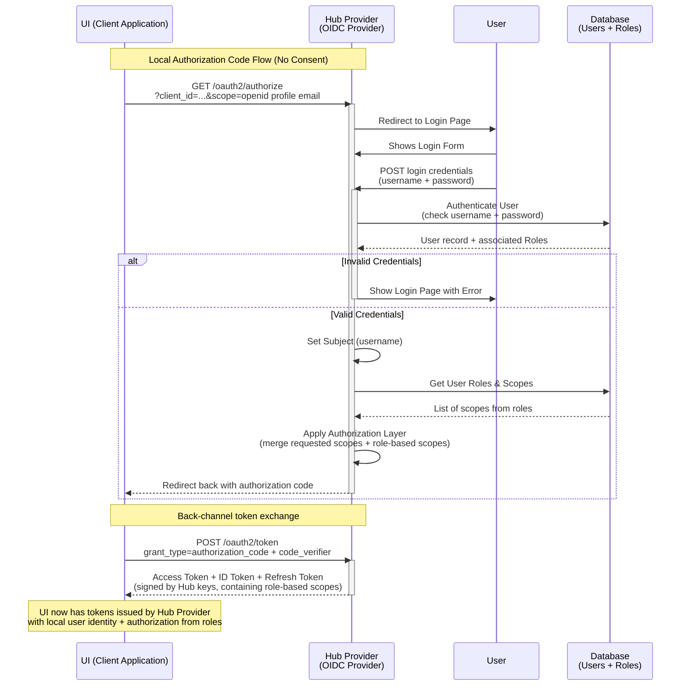
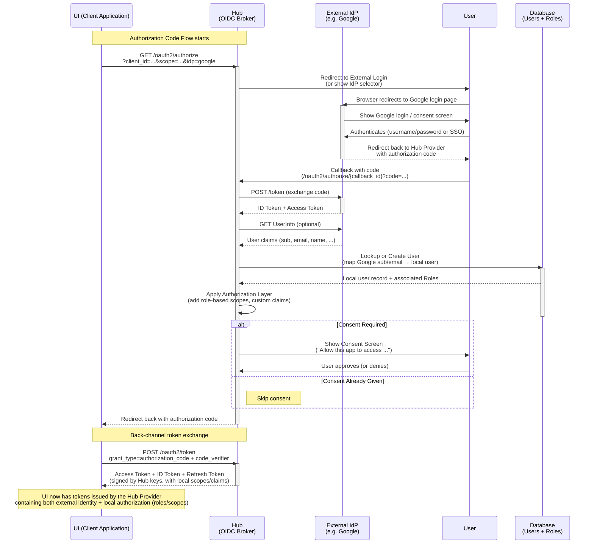

# Provide builtin AuthZ

Add builtin AuthZ functionality so that KeyCloak is no longer required.

## Release Signoff Checklist

- [ ] Enhancement is `implementable`
- [ ] Design details are appropriately documented from clear requirements
- [ ] Test plan is defined
- [ ] User-facing documentation is created

## Open Questions

## Summary

Currently, keycloak is required to provide user authentication and authorization. Both the Hub
and the UI integrate with Keycloak using keycloak clients. The goal convert to OIDC (OpenID)
for AuthZ integration and remove the dependence on keycloak.  Further, to provide an
internal OIDC provider with optional delegation to an external OIDC provider (such as Keycloak
but can be anything).

## Motivation

Eliminate dependence on Keycloak.

### Goals

- To provide AuthZ _out-of-the-box_.
- To (optionally) delegate authentication to an external OIDC provider
- To (optionally) delegate authorization to an external OIDC provider.
- To discontinue dependence on keycloak.
- To discontinue seeding the realm in keycloak.
- To support user management in the tackle UI.
  - User CRUD.
  - Role CRUD
  - User role assignment.

### Non-Goals

## Proposal

Make the hub an OIDC provider. The provider policy may be self-contained or configured
to delegate authentication and/or authorization to an external provider. Th hub inventory
is augmented to include Users and Roles. Users may be associated to roles and roles may
be associated to permissions (scopes).  Tokens will continue to contain scope claims.

When and external provider is configured, the login page rendered by the hub will contain a
button for this.  For example: "Login with Google".

The UI will be updated to use OIDC (instead of keycloak) and be configured to use the
hub OIDC provider.  The UI will have pages to manage user, roles and permissions.

### Security, Risks, and Mitigations

The [go-oidc](https://github.com/luikyv/go-oidc) package is **OpenID certified** and is actively maintained. It has no reported CVEs.  AI code analysis
reports no vulnerabilities or backdoors.

## Design Details

### Test Plan

- Add hub binding tests for User, Role resources.
- Add authz tests using OIDC client.
- TBD

### Upgrade / Downgrade Strategy

