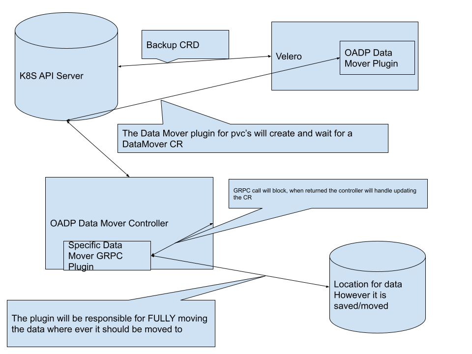

# Data Mover Design

## Release Signoff Checklist

- [x] Enhancement is `implementable`
- [x] Design details are appropriately documented from clear requirements
- [ ] Test plan is defined
- [ ] User-facing documentation is created

## Open Questions [optional]

1. Do we want to try and get our GRPC endpoints into CSI or Openstorage API or both?

## Summary

Creating a common interface for datamovers, with a shared controller for that interface and using GRPC for datamover plugins. We will also create a velero plugin that will manage this new CRD when PVC's or PV's are attempted to be backed up. 

## Motivation

As more and more vendors use OADP as a common interface for interacting with backup and restore on an openshift cluster, these vendors want a deeper integration into how to move data. Right now, the primary methods that OADP moves data is through restic backup of a volume to an object bucket or via CSI snapshots that are off cluster. Some vendors don't fit into either of these buckets and they would like to easily provide their own version of a data mover to fully support user backups.

### Goals

List the specific goals of the proposal. How will we know that this has succeeded?

1. An overall design, that will give a high level vision for how to allow for velero to interact with 

### Non-Goals

1. Creating a data mover for production use
2. Define interfaces/types and structures in this enhacement. These should be defined in follow on enhancement.

## Proposal

There are 3 new pieces here but first lets discuss the pieces that are being re-used. 

We will create Velero plugin for [Volume Snapshotter and Backup Item Action](https://velero.io/docs/v1.6/custom-plugins/#plugin-kinds). This will allow us to determine when a Volume is being backed up and complete the necessary actions to move the data to the correct place. These are well known with lots of prior art. We should use the [CSI-plugin](https://github.com/vmware-tanzu/velero-plugin-for-csi) and the [restic](https://github.com/vmware-tanzu/velero/blob/5bd70fd8eef316d220317245e46dc6016c348dce/pkg/restic/repository_manager.go#L131) plugin as an example. 

We will need to create a Data Mover Controller. This controller will watch a DataMover CRD where the status of moving data will be published. This Controller's only responsiblity to delegate via GRPC to the correct Data Mover. 

A vendor will be able to supply a data mover as long as it conforms to a certain interface to provide moving the data for that particular set of data. For a default implementation we may want to consider how this will work.

Another usecase that we should consider for the "DatamMover" CRD is to handle moving VolumeSnapshots to a different location. 

### User Stories

#### Story 1

As a data storage provider, I would like to provide my own data mover to integrate with OADP as the standard backup and restore tool. 

#### Story 2

As a user, I would like to move my snapshot to a different location off cluster for backup.

### Implementation Details/Notes/Constraints

There is no implementation details as these will be discussed in future enhacements.

### Risks and Mitigations

There will be issues with security that we will need to consider. These should be focused on how we use RBAC. For Story 2 we will have to be sure to verify that the user has access to the PVC/VolumeSnapshot that they are asking to move. 

Another security concern is the permissions that would be required for a specific Data mover plugin to have access to the underlying data storage or location.

## Design Details

### Test Plan

Each follow on enhancement should for it's piece of the puzzle have a detailed test plan. 

### Upgrade / Downgrade Strategy

Each follow on enhancement should for it's piece of the puzzle have a detailed strategy for upgrade and downgrade. 

We will need to have versioing from the start, and a backwards compatability guide.

## Implementation History

We have created a plugin for the openshift resources. 

The CSI velero plugin already exists and can be used as a resource. 

VolumeProvisioner's and VolumePopulators from the CSI org are also good example of the concepts.

## Drawbacks

The major drawback with this approach is that it is another interface that the storage providers will need to conform to. To get buy in for this approach we will need to work closely with the vendors to make sure that the interface gives them what they need to complete the actions. This could take a lot of work to do well and could take a long time to complete.

## Alternatives

Prior work was explored in the [data-mover](https://github.com/konveyor/data-mover/pull/3) repo. 