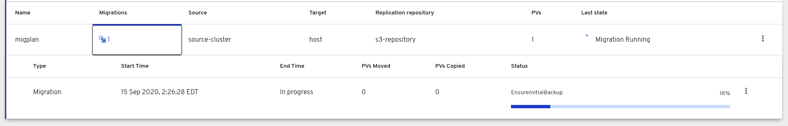

# MTC Progress Reporting Improvements

The goal of this document is to highlight user experience issues in the current implementation of progress reporting in MTC, and propose improvements in some of the areas for a better user experience. The driving goal of the effort is to ensure that the user has enough information in their hands to understand what exactly is happening in the background of an ongoing migration. 

## Release Signoff Checklist

- [x] Enhancement is `implementable`
- [ ] Design details are appropriately documented from clear requirements
- [ ] Test plan is defined
- [ ] User-facing documentation is created

## Summary

With the proposed changes, the migration controller will expose useful data pertaining to the progress of ongoing migration, likely in the status field of _MigMigration_ CR. The MTC UI will be re-designed to incorporate the enhancements, possibly adopting a pipeline like view for showing progress. Additionally, the current migration phases will be divided into high level groups / steps of relevant phases. The new steps will abstract out some of the details of the migration from the end user. The existing phases will only be _hidden_ from the end user, and will still be available in the _MigMigration_ CR for debugging. 

## Motivation

The motivation behind the said changes stems from some of the user experience issues observed in MTC.

### How progress reporting looks like in MTC (Until 1.3)?

The Status field in the _MigMigration_ CR contains the information about the progress of ongoing migration. Upon creation of _MigMigration_ CR, the migration transitions from one _Phase_ to another until it reaches the _Completed_ phase. For a user, a _Phase_ simply means a one of the _Steps_ in the migration. 

Here is an example of _MigMigration_ status field during an ongoing migration:

```yml
  conditions:
  - category: Advisory
    lastTransitionTime: "2020-09-15T14:54:46Z"
    message: 'Step: 7/33'
    reason: InitialBackupCreated
    status: "True"
    type: Running
  - category: Required
    lastTransitionTime: "2020-09-15T14:53:15Z"
    message: The migration is ready.
    status: "True"
    type: Ready
  itenerary: Final
  observedDigest: 9834d071975562d5e2c2eb855bca6950711ded8a0e45af5307fa56cd0f5ba3c7
  phase: InitialBackupCreated
  startTimestamp: "2020-09-15T14:53:15Z"
```

The `message` field shows how many steps/phases have been completed so far in the migration. The total number of steps change based on whether it's a stage migration or a full migration. The MTC UI uses this field to derive progress in percentages and depicts it in the form a progress bar:



### Issues with the current implementation

* In a full migration, there are over 30 steps/phases involved. The migration transitions from one phase to another until completion. All these phases are posted to the Status field of the _MigMigration_ CR as and when encountered. We cannot expect an end user to know the meaning of each of these phases. For instance, one of the migration phases is `EnsureCloudSecretPropagated`. While, from a debugging point of view, knowing that the migration is attempting to propagate cloud secret is an important piece of information, it is questionable how much value it adds to the end user experience. 

* Some phases in migration run for a longer period of time than other phases. For such long running phases, MTC currently does not have a way to inform the user of the progress of the ongoing phase itself. For instance, during an initial Backup, the migration controller enters `EnsureInitialBackup` phase where it creates a Velero Backup object and transitions to `InitialBackupCreated` phase upon successful creation of Backup. It then waits until the underlying Backup object has a Completed / PartiallyFailed / Failed condition. While the backup runs in the background, the end user only sees `InitialBackupCreated` in the progress bar. The problem aggrevates when the Backup contains a huge number of resources. The progress bar is stuck in `InitialBackupCreated` phase with a certain percentage value for a very long period of time. The user is left with no reason to believe that there's actually something happening in the background.

## Proposal

To address the problems discussed in the previous section, we propose to make two modifications:

1. Provide detailed progress information of an ongoing migration phase in _MigMigration_ CR
2. Group existing phases into relevant steps to simplify user view

### Enhancement 1: Grouping migration phases

With the progress information relayed in the _MigMigration_ CR, we believe that the user will have enough information in their hands to understand what exactly is happening in the background. We can then simplify the migration by dividing existing phases into broader steps of migration.  

All _Phases_ in a migration can be grouped into following high level steps that abstract out the details from the end user:

* Prepare
* StageBackup
* Backup
* StageRestore
* Restore
* DirectImage
* DirectVolume
* Cleanup

The _MigMigration_ CR is updated to include a new field `status.pipeline` designed to show transition of steps in a migration:

```go
// MigMigrationStatus defines the observed state of MigMigration
type MigMigrationStatus struct {
	Conditions         `json:",inline"`
	UnhealthyResources `json:",inline"`
	ObservedDigest     string       `json:"observedDigest,omitempty"`
	StartTimestamp     *metav1.Time `json:"startTimestamp,omitempty"`
	Phase              string       `json:"phase,omitempty"`
	Pipeline           []*Step      `json:"pipeline,omitempty"`       <---- New field
	Itinerary          string       `json:"itinerary,omitempty"`
	Errors             []string     `json:"errors,omitempty"`
}

// Step defines a task in a step of migration
type Step struct {
	Timed `json:",inline"`    <---- Timestamps

	Name     string   `json:"name"`
	Phase    string   `json:"phase,omitempty"`      <---- Currently ongoing phase
	Message  string   `json:"message,omitempty"`    <---- Human readable description of phase
	Progress []string `json:"progress,omitempty"`   <---- Provides detailed progress information
	Failed   bool     `json:"failed,omitempty"`
	Skipped  bool     `json:"skipped,omitempty"`
}
```

### Enhancement 2: Detailed progress of phase

`task.go` introduces a new function `setProgress([]string)` which will set the `Pipeline[*].Progress` field with a list of custom progress messages provided by the phase. The changes will be applied before next reconcile returns. 

The standard format followed for each progress message in the array is:

```
<kind> <namespace>/<name>: <message>
```

The above format allows the UI to parse the messages. 

#### Relationship between Step and Phase

Each phase in the migration will belong to some _Step_ based on the the _Itinerary_. A new field `Step` in the `Phase` struct allows associating a phase with a step:

```go
// Phase defines phase in the migration
type Phase struct {
	// A phase name.
	Name string
	// High level Step this phase belongs to
	Step string             <---- New field
	// Step included when ALL flags evaluate true.
	all uint16
	// Step included when ANY flag evaluates true.
	any uint16
}
```

#### How will migration progress through different steps?

In this section, we will discuss how a journey of a migration will look like to an end user.

##### Scenario 1: Migration completed without issues

Migration enters `Prepare` step, moves forward to `Backup` step, and so on until reaching the `Final` step and returning successfully.

```
Prepare -> Backup -> StageBackup -> StageRestore -> Restore -> Cleanup
```

##### Scenario 2: Migration fails during StageBackupCreated phase

Migration enters `Prepare` step, moves forward to until `StageBackup` step and fails. Then, it skips the remaining steps and jumps to `Final` step. 

```
Prepare -> Backup -> StageBackup (Failed Here) -> StageRestore (Skipped) -> Restore (Skipped) -> Cleanup
```

A user now knows where exactly the migration failed, they can inspect the _MigMigration_ CR and report the actual phase it failed at. 


### Implementation Details/Notes/Constraints

#### Velero Restore Progress

As of Velero 1.4, _Restore_ objects do not have Progress reported in the Status field like _Backup_ objects. In the first iteration, we will only show progress of _Restore_ objects in the form of `InProgress, Completed, Failed, PartiallyFailed`. Next, we will implement the Progress for Restore objects in Konveyor Velero fork and eventually, work to get the features submitted upstream.

