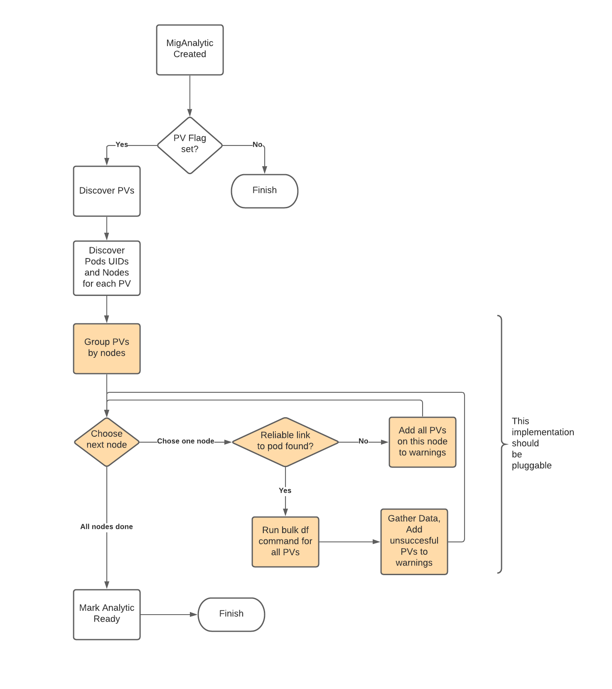

# Intelligent PV resizing

When using Direct Volume Migration in MTC to migrate Persistent Volume data, MTC creates volumes in the target cluster by using Persistent Volume Claims found in the source namespaces. The capacity of the new Persistent Volume in the target cluster is determined by the requested capacity in its Persistent Volume Claim. While this approach works well in most scenarios, there are some cases in which the capacity of Persistent Volume in the source cluster may actually be different than the requested capacity in its Claim. In such cases, the migration of data will fail if the capacity of the volume is more than requested. This document proposes a solution to address this problem primarily in MTC's direct migration workflow while leaving room for similar improvement in the indirect migration. 

## Release Signoff Checklist

- [x] Enhancement is `implementable`
- [x] Design details are appropriately documented from clear requirements
- [x] Test plan is defined
- [ ] User-facing documentation is created

## Summary

As stated in the opening section, the actual capacity of a provisioned volume isn't necessarily same as the requested capacity in its claim. Both direct and indirect migration workflows in MTC don't take into account such a scenario. For instance, GlusterFS storage in OpenShift 3.11 cannot handle requested capacities in the granularity of Megabytes or below. As a result, when a user requests a volume of 1100Mi, the provisioned volume will actually be of 2Gi capacity. However, when Velero restores such a volume in a cluster with AWS EBS backed storage, the resulting volume will match its requested size i.e. 1100Mi. This will make a migration fail if the volume in the source contains more than 1100Mi of data. Additionally, when volume usage in the source cluster is close to 100%, it is likely that the same data may require more than 100% of capacity in the target cluster due to differences in underlying storage classes. MTC doesn't handle this scenario either. This document proposes a solution to accurately determine the resulting volume size for Direct Volume Migration. The approach described in this document can also be applied to indirect volume migrations. 

## Motivation

When working with one of our upstream tooling - [pvc-migrate](https://github.com/konveyor/pvc-migrate) in a production environment, we ran into a scenario where the users had resized several GlusterFS volumes using Gluster CLI. The volumes were originally created by dynamic provisioner through PVCs. The size of the volumes were no longer equal to their respective requested sizes in the claims. This shows that it is not uncommon to find examples of volumes in production where their actual capacities and apparent capacities differ. 

### Goals

1. Accurately determine and adjust the size of the volume to be restored such that the data copy operations don't result into failure caused due to insufficient disk space. 
2. Provide a way for the user to verify the newly adjusted volume size or propose their own value in Mig UI
3. Design a solution which can be easily ported to indirect volume migration in the future.

### Non-Goals

1. Guarantee 100% accuracy in adjusted volume size 

## Proposal

The proposed solution will work in three steps:

1. Gathering disk capacity and actual usage data from the source cluster.
2. Computing resulting disk capacity in the target cluster
3. Creating the volume in the target cluster


> Please note that if we intend to implement the above for Indirect Volume Migrations in future, Steps 1 & 2 will be common for both direct and indirect, while Step 3 will be implemented separately in both. 

To determine the usage information, the _MigPlan_ controller will depend on _MigAnalytic_ CR.

#### Gathering disk capacity and actual usage data from the source cluster.

_MigAnalytic_ controller will run `df` command in one of the Restic Pods which is mounting the source volume. The information for each volume will be stored in the _MigAnalytic_ status. When the controller fails to gather this information, it will raise a _Warning_ condition to inform the user that the volume capacity cannot be adjusted automatically. However, this will not be considered a _fatal_ failure and migrations can still continue despite this missing information. 

#### Computing resulting disk capacity in the target cluster

Once, _MigAnalytic_ controller finishes running `df` for all volumes, it will compute the new adjusted capacity. The controller will use the maximum of the following values as the resulting capacity for the to-be-restored volume:

- Actual used volume size + threshold value in percentage
- Actual provisioned volume capacity
- Requested volume capacity in the Persistent Volume Claim

The "threshold" value specified above will be set to 3% by default and will be configureable through an exposed variable in _MigrationController_ or _MigPlan_ CR. 

_MigPlan_ controller will read the _status_ field of _MigAnalytic_ and find an intersection between the volumes present its own list and the ones present in the _MigAnalytic_ status. For all volumes found in the intersection, _MigPlan_ will add the `adjustedCapacity` field in its own spec. In the Mig UI, the new adjusted size will be displayed in the MigPlan Wizard. An editeable field (disabled by default) for adjusted volume size will allow user to either confirm the size or propose a new size by enabling the editeable field with the help of a check box. The Mig UI will run validation on the field such that the user cannot propose a smaller value than the original requested size of the volume. Additionally, similar validation will be implemented in the _MigPlan_ controller to allow similar experience for CLI users. The _MigPlan_ controller will add a new field in the plan's spec to indicate the adjusted capacity.

#### Creating the volume in the destination cluster

##### Direct Volume Migration

The DVM controller will read the _MigPlan_ spec to determine if the capacity of the volume is adjusted previously. If the adjusted capacity is found, DVM will use it. It will use the original capacity otherwise. 

---

### User Stories [optional]

#### Story 1

As a user, I want to be able to see the *proposed* destination volume size (along with the reasons) in an editable field on MigPlan wizard at the time of selecting Storage Class for each volume so that I can confirm the automatically adjusted size or suggest my own value.

### Implementation Details/Notes/Constraints [optional]

#### Using Restic pod to run df command

Since the application pod which is using the volume may or may not have `df` command installed, Restic pods are a good choice to run the `df` command. However, this makes the solution completely rely on the fact that Restic will always be available in the source cluster. Another approach would be to launch a temporary pod to gather this information. Some storage classes also report volume usage information as metrics. We can leverage this information for known storage classes. To ensure we have an easy way to implement one of the alternatives in the future, the Step 1 of the solution will be implemented as a well-interfaced module:




#### Size conversions 

The requested capacity in a Persistent Volume Claim either follows standard SI notation or their power-2 equivalents as specified [here](https://github.com/kubernetes/community/blob/master/contributors/design-proposals/scheduling/resources.md#resource-quantities). The `df` command on the other hand only follows the SI notation. It is important for the controller to accurately convert all sizes from-to / to-from Kubernetes and `df` units. The conversion code should be absolutely bug free and tested for all posssible sizes.  

#### Handling updates to volumes post creation of MigPlan

It is possible that the volumes may be resized after the migplan was created. Since _MigPlan_ is reconciled once before running a migration, it is possible to add a warning condition on _MigPlan_ whenever a change is detected in the volume capacity after user made the selection. 

The change can be handled in two ways: 
1. MigPlan can be marked "Not Ready" and we can force user to make the selection again
2. Migration can proceed by choosing a maximum of the following values:
  - Previous capacity confirmed/selected by the user
  - New calculated adjusted capacity
  

### Risks and Mitigations [Omitted]

## Design Details

### Test Plan 

#### E2E Test Cases

1. Scenario 1: Source volume size != requested size & usage less than 97%

In this case, the restored volume will be resized to whatever its actual volume size is in the source cluster.

2. Scenario 2: Source volume usage close to 98%

In this case, the restored volume will be resized to 101% of its original capacity. 

3. Scenario 3: Source volume size == requested size & volume usage less than 97%

The expected behaviour in this case will be that the original requested size of the volume will be used "as-is" for the restored volume. 

### Upgrade / Downgrade Strategy

There will be a change in MigPlan API. We will introduce a new field in _MigPlan_ spec to add the volume adjustment information:

```yml
apiVersion: migration.openshift.io/v1alpha1
kind: MigPlan
metadata:
  [...]
  annotations:
    openshift.io/touch: 59e3e104-5b3d-11eb-89bf-0a580a800316
  name: migplan-02
  namespace: openshift-migration
spec:
  [...]
  persistentVolumes:
  - capacity: 3Gi
    name: pvc-27c0bd90-5b3a-11eb-9ab3-0a06fd6a26f8
    adjustedCapacity: 4Gi        <---
    pvc:
      accessModes:
      - ReadWriteOnce
      hasReference: true
      name: pvc-0
      namespace: hook-test
    selection:
      action: copy
      copyMethod: filesystem
      storageClass: gp2
    storageClass: glusterfs-storage
    supported:
      actions:
      - copy
      - move
      copyMethods:
      - filesystem
      - snapshot
status:
  conditions:
  [...]
  destStorageClasses:
  [...]
  excludedResources:
  [...]
  observedDigest: d52e0fb317e62669f1d7b516849be7f8c127f40c1f89582acf5e374d16e088ef
  srcStorageClasses:
  [...]
  srcVolumes:
  - name: pvc-27c0bd90-5b3a-11eb-9ab3-0a06fd6a26f8    <---
    actualCapacity: 4Gi                               <---
    requestedCapacity: 3Gi                            <---
    usage: 98%                                        <---
    adjustedCapacity: 4200Mi                          <---
    reason: The source volume is almost full.         <---
```

Currently, I am assuming the new changes will be fully backward-compatible.

## Implementation History [omitted]


## Drawbacks [omitted]


## Alternatives [omitted]