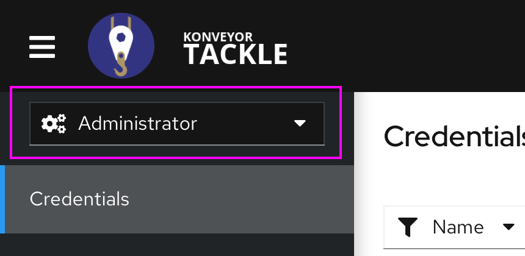
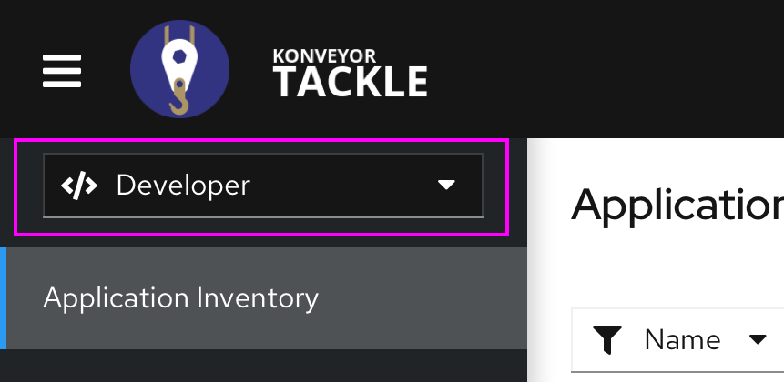

# Tackle integration with Git, SVN and Maven repositories

## Release Signoff Checklist

- [X] Enhancement is `implementable`
- [X] Design details are appropriately documented from clear requirements
- [X] Test plan is defined
- [X] User-facing documentation is created

## Open Questions

None so far.

## Summary

Application source code and binaries are typically stored and managed using corporate repositories. Most projects from the Tackle toolkit require access to source code to perform their function, and manually downloading source and/or binaries doesn't work well at scale. This enhancement proposes the integration of Tackle with the most widespread source and binaries repositories to automate the task of gathering source and binaries for them to be fed to the Tackle tools that might require them. Since credentials are required to access these repositories in most cases, a big part of this enhancement is dedicated to safely store and manage them.

## Motivation

Gathering source code and binaries is almost always a difficult task when working on large scale migration projects with customers. In most cases, the customer will provide the migration team with just a spreadsheet with application information, including URLs for source repositories or artifact repositories for each application or component.

Having application source and/or binaries when the assessment phase starts is key to have an analysis that provides a holistic view of the application portfolio and hence for the success of the assessment itself. It is true that the migration team could create scripts to consume that information and automate the download of source code and/or artifacts themselves, but the process would be time consuming and would require some automation skills that not AppDev Architects/Consultants have.

### Goals

- Enhance the Application entity to store information about source and binary repositories.
- Provide a way to store and manage credentials safely.
- Add an administration view that can accommodate application wide configurations and sensitive data management.

### Non-Goals

- Provide clone/checkout/download logic for addons to get access to the source or binaries. Each addon will be responsible of gathering source or binaries by itself using the credentials provided by Tackle Hub.

## Proposal

### Personas / Actors

#### Administrator

The administrator for the tool that has access to some application-wide configuration parameters that other users can consume but not change or browse. Example: Git credentials, Maven settings.xml files.

#### Architect

A technical lead for the migration project that can create and modify applications and information related to it. The Architects don’t need to have access to sensitive information, but can consume it. Example: Associate an existing credential to access the repository of a given application.

#### Migrator

A developer that should be allowed to run assessments and analysis, but not to assess, create or modify applications in the portfolio.

#### Organization Administrator

A member of the operations or security team of the organization undergoing the adoption/migration initiative. The Organization Administrator manages the credential when there are security constraints that would prevent the Administrator from managing that information (For example when the Administrator belongs to the adoption team and that has been outsourced to a third party company).

### User Stories

#### Global Configuration

##### GLC001

*As an Administrator I want to be able to manage the global configuration for the tool through an administration panel.*

#### Credentials Management

##### CM001

*As an Administrator I want to be able to manage credentials so that they can be consumed by other regular users without compromising the security of the accessed systems.*

##### CM002

*As an Administrator I want to be able to manage Git User/Password credentials.*

##### CM003

*As an Administrator I want to be able to manage SSH Keys for Git access.*

##### CM004

*As an Administrator I want to be able to manage Subversion User/Password credentials.*

##### CM005

*As an Administrator I want to be able to manage settings.xml files so that they can be used to retrieve Maven artifacts.*

##### CM006

*As an Administrator I want to be able to manage Proxy User/Password credentials.*

##### CM007

*As an Architect I want to be able to assign existing credentials to applications on a per application or bulk basis.*

##### CM008

*As a Migrator or an Architect I want to be able to filter applications by the type of credentials assigned to it*

#### Git Configuration

##### GC001

*As an Administrator I want to be able to manage global Git configuration.*

##### GC002

*As an Administrator I want to be able to configure if insecure Git repositories (no SSL or self signed certificate) can be consumed.*

##### GC003

*As an Architect I want to be able to associate a Git repository to an application.*

##### GC004

*As a Migrator or an Architect I want to be able to filter applications by having a Git repository assigned*

#### Subversion Configuration

##### SC001

*As an Administrator I want to be able to manage Global Subversion configuration.*

##### SC002

*As an Administrator I want to be able to configure if insecure Subversion repositories (no SSL or self signed certificate) can be consumed.*

##### SC003

*As an Architect I want to be able to associate a Subversion repository to an application.*

##### SC004

*As a Migrator or an Architect I want to be able to filter applications by having a Subversion repository assigned*

#### Maven Configuration

##### MC001

*As an Administrator I want to be able to manage global Maven configuration.*

##### MC002

*As an Administrator I want to be able to configure the default behavior for forced updates for artifacts and dependencies on each analysis.*

##### MC003

*As an Administrator I want to be able to configure if insecure Artifact Repositories (no SSL or self signed certificate) can be consumed.*

##### MC004

*As an Administrator I want to be able to know the size of the local artifact repository.*

##### MC005

*As an Administrator I want to be able to purge the local artifact repository.*

##### MC006

*As an Architect I want to be able to associate an artifact with an application.*

##### MC007

*As a Migrator or an Architect I want to be able to filter applications by having a Maven artifact assigned*

#### Proxy Configuration

##### PC001

*As an Administrator I want to be able to manage global Proxy configuration.*

##### PC002

*As an Administrator I want to be able to configure a HTTP proxy host including host and port*

##### PC003

*As an Administrator I want to be able to assign credentials to a HTTP proxy*

##### PC004

*As an Administrator I want to be able to configure a HTTPS proxy host including host and port*

##### PC005

*As an Administrator I want to be able to assign credentials to a HTTPS proxy*

##### PC006

*As an Administrator I want to be able to configure a list of hosts to exclude from HTTP/HTTPS proxy*

### Functional Specification

#### Administrator Perspective

##### Related Use Cases

- [GLC001](#GLC001)
- [CM001](#CM001)
- [GC001](#GC001)
- [SC001](#SC001)
- [MC001](#MC001)
- [PC001](#PC001)

##### Involved Personas

- [Administrator](#administrator)

##### Description

An Administrator Perspective is proposed as the way for the Administrator to access the administration panel for the tool. The user experience here should be consistent with the Administrator Perspective available in OCP 4.x, using the perspective switcher component:

  
  

For consistency sake with the user experience in OCP, the names “Administrator” and “Developer” will be kept for the two different perspectives available for the moment.

The Control Menu on the left will display the following options under the Administrator Perspective:
- Credentials
- Repositories
  - Git
  - Subversion
  - Maven
- Proxy

Organization Administrators will have access to the Administrator perspective, but only the "Credentials" option will be available on the left menu.

For the Developer perspective, the same options from previous releases remain:
- Application Inventory
- Reports
- Controls

#### Credentials Management

##### Related Use Cases

- [CM001](#CM001)
- [CM002](#CM002)
- [CM003](#CM003)
- [CM004](#CM004)
- [CM005](#CM005)

##### Involved Personas

- [Administrator](#administrator)
- [Organization Administrator](#organization-administrator)

##### Description

###### Main View

The main Credentials Management view can be reached by clicking on the “Credentials” option from the Control Menu from the Administrator Perspective. This will display a view with a table with the list of available credentials, including the following fields:

- Name
- Description
- Type
- Created by

Each row will have an edit and a delete button. On the header of that table, a filter will allow the user to filter the table based on any of the previous fields as criteria. On its right, a “Create new” button will allow the user to create credentials.

###### Create Credentials

By clicking on the “Create new” button, the system will open a modal window with the following fields:
- Name: String
- Description: String (Optional)
- Type: Dropdown, single selection. Values:
  - Source Control
  - Maven Settings File
  - Proxy

If the user selects “Source Control” in the Type field, the following fields will load on the modal window dynamically:
- User credentials: Dropdown, single selection. Values:
  - Username/Password
  - SCM Private Key/Passphrase

If the user selects "Username/Password" in the "User credentials" dropdown, the following fields will load dynamically:

- Username: String
- Password: String (Hidden)

If the user selects "SCM Private Key/Passphrase" in the "User credentials" dropdown, the following fields will load dynamically:

- SCM Private Key: String.
- Private Key Passphrase: String (Hidden)

The SCM Private Key field should allow the user to paste the Key content directly or drag and drop the private key file. If the user goes for the second approach, the file will be uploaded to the system and displayed on the field afterwards.

In case the user selects "Maven Settings File" in the "Type" dropdown, the following fields will load on the modal window dynamically:

- Settings File: String

As in the SCM Private Key field, the user should be able to paste the Key content directly or drag and drop the settings.xml file. Again, if the user goes for the second approach, the file will be uploaded to the system and displayed on the field afterwards.

Finally, if the user selects "Proxy", the following fields will load dynamically:

- Username: String
- Password: String (Hidden)

There will be two buttons at the bottom of the modal window:
- **Save**: Validates the input and creates a new credential. SCM keys and Maven settings.xml files must be parsed and checked for validity. If the validation fails, an error message displaying “not a valid key/XML file” should be displayed.
- **Cancel**: Exists the modal window. If any data has been entered, the system will ask for confirmation.

###### Edit Credentials

The edit button on a credential from the list available on the main view will open a modal window similar to the one in the Create Credentials view. The fields displayed on the window will depend on the credential type and user credentials provided on creation. For example, for Maven credentials, the following fields will be displayed:

The user won't be able to see the value of the Settings File field, with “Encrypted” displayed in the field value instead.

For source credentials using Username/Password authentication, the Password will appear hidden:

Finally, for source credentials using SCM Private Key/Passphrase, the approach will be similar to what we have seen for Maven credentials:

The SCM Private Key field will display "Encrypted" as well, with the Private Key Passphrase field displaying a hidden value.

###### Delete Credentials

The delete button on a credential from the list available on the main view will delete a set of credentials after user confirmation. If the credentials have been associated with any application, the system will ask for additional confirmation with the following message:

#### Git Configuration

##### Related Use Cases

- [GC001](#GC001)
- [GC002](#GC002)

##### Involved Personas

- [Administrator](#administrator)

##### Description

Clicking on the "Git" suboption under the "Repositories" option on the left menu from the Administrator perspective will open the Git configuration view. This view will include the following fields:

- Consume insecure Git repositories: Switch.

#### Subversion Configuration

##### Related Use Cases

- [SC001](#SC001)
- [SC002](#SC002)

##### Involved Personas

- [Administrator](#administrator)

##### Description

Clicking on the "Subversion" suboption under the "Repositories" option on the left menu from the Administrator perspective will open the Subversion configuration view. This view will include the following fields:

- Consume insecure Subversion repositories: Switch.

#### Maven Configuration

##### Related Use Cases

- [MC001](#MC001)
- [MC002](#MC002)
- [MC003](#MC003)
- [MC004](#MC004)
- [MC005](#MC005)

##### Involved Personas

- [Administrator](#administrator)

##### Description

Clicking on the "Maven" suboption under the "Repositories" option on the left menu from the Administrator perspective will open the Maven configuration view. This view will include the following fields:

- Repository size: Read only. Must include used size out of the available size for Maven dependencies.
- Force update of dependencies: Switch. Disabled by default.
- Consume insecure artifact repositories: Switch. Disabled by default.

The view must include a button "Clear repository" to purge the local Maven repository. Clicking on it will open a confirmation window with the following message: *This will clear the local Maven repository and considerably slow down builds until dependencies are collected again. Do you wish to continue?*.

It would be advisable to include tooltips to explain fields:

#### Proxy Configuration

##### Related Use Cases

- [PC001](#PC001)
- [PC002](#PC002)
- [PC003](#PC003)
- [PC004](#PC004)
- [PC005](#PC005)
- [PC006](#PC006)

##### Involved Personas

- [Administrator](#administrator)

##### Description

The Proxy configuration view can be reached by clicking on the “Proxy” option from the Control Menu from the Administrator Perspective. It will display the following fields:

- HTTP proxy: Switch, disabled by default.
- HTTPS proxy: Switch, disabled by default.

Enabling the "HTTP proxy" switch will dynamically load the following nested fields:

- HTTP proxy host: String
- HTTP proxy port: Numeric
- Authentication: Switch, disabled by default.

If the user enables the "Authentication" switch, the following nested field will load dynamically:

- HTTP proxy credentials: Dropdown, single selection. Values are populated from available Proxy credentials.

Similarly, if the user enables the "HTTPS proxy" switch, the following nested fields will be loaded dynamically:

- HTTPS proxy host: String
- HTTPS proxy port: Numeric
- Authentication: Switch, disabled by default.

In the same fashion as before, if the user enables the "Authentication" switch, the following nested field will load dynamically:

- HTTPS proxy credentials: Dropdown, single selection. Values are populated from available Proxy credentials.

Enabling any of the "HTTP proxy" or "HTTPS proxy" switches will dynamically load the following field at the bottom of the screen:

- Hosts to exclude from HTTP/HTTPS proxy: Textbox.

This field should not look nested to either of the switches, as it applies to both proxy configurations. The list of hosts to exclude should be comma separated.

#### Assign Credentials to Applications

##### Related Use Cases

- [CM007](#CM007)

##### Involved Personas

- [Architect](#architect)

##### Description

###### Bulk Assignment

The Application Inventory view will include a new button “Manage Credentials” in the kebab menu of the main table. This button will be enabled only if at least one application has been selected on the table below.

Clicking on the button will open a modal window with the following fields:

- Selected applications: List of the selected applications. Non-editable.
- Source credentials: Dropdown
- Maven settings: Dropdown

If all the applications selected happen to have the same values for a field, it will appear selected. If not, the field will appear with no selection. The values for each field will come from the list of credentials already available in the system:

- The Source credentials dropdown will display a list with all Source credentials available on the system.
- The Maven credentials dropdown will display a list of all Maven Settings file credentials available on the system.

If any of the applications already has any credentials assigned, a warning should be displayed on the modal window.

Clicking on Save will assign the credentials to the selected applications. After the assignment is done, credentials type should appear on the expandable section for each application details:

Possible values will be Source and Source & Maven.

###### Individual Assignment

Credentials can also be assigned on a per application basis. The kebab menu on each application row will include a new option "Manage credentials".

This will open a modal window with the following fields:

- Application: Selected application. Non-editable.
- Source credentials: Dropdown
- Maven settings: Dropdown

The Save button won't be enabled unless changes are made on any of the editable fields.

#### Repository configuration at Application level

##### Related Use Cases

- [GC003](#GC004)
- [SC003](#SC004)
- [MC006](#MC006)

##### Involved Personas

- [Architect](#architect)

##### Description

Application creation and edition modal windows will be rearranged to accommodate repository information. The windows will be divided in three expandable sections, with different field on each one of them:

-  Basic Information:
  - Name: String. Required.
  - Description: Textbox.
  - Business service: Dropdown. Multiple selection. Values are populated from the list of available Business Services.
  - Tags: Dropdown. Multiple selection. Values are populated from the list of available Tags.
  - Comments: Textbox.

- Source code:
  - Source repository: String. Required if either Branch or Root path have any value.
  - Branch: String.
  - Root path: String.

- Binary:
  - Group: String. Required if any other field from the Binary section has a value.
  - Artifact: String. Required if any other field from the Binary section has a value.
  - Version: String. Required if any other field from the Binary section has a value.
  - Packaging: String. Optional (defaults to jar).

Some validations rules will be required, as source and binary fields are not mandatory but partially filling them shouldn't be allowed. If the user enters partial values on the Source or Binary sections, validation will be executed when clicking the "Create" button. For example, if the user only enters the Group for a binary:

Validation will be executed when clicking on the create button, indicating the missing fields:

The same applies for fields in the Source section when Branch or Root path values are entered without a repository.

Based on the Source repository URL, the system should be able to determine the repository kind (Git or Subversion) and store it accordingly.

#### Additional filtering

##### Related Use Cases

- [CM008](#CM008)
- [GC004](#GC005)
- [SC004](#SC005)
- [MC007](#MC007)

##### Involved Personas

- [Architect](#architect)
- [Migrator](#migrator)

##### Description

New filters should be implemented to allow filtering based on criteria related to the new information available on the application profile:

- **Credentials**: Kind of credentials assigned to a given application. Values:
  - Source
  - Maven
  - None
- **Git repository**: Applications that have an associated Git repository.
- **Subversion repository**: Applications that have an associated Subversion repository.
- **Maven artifact**: Applications that have an associated Maven artifact.

### Implementation Details/Notes/Constraints

- Git uses both HTTPS and SSH as communication protocols, thus allowing authentication via an user/password pair and SSH keys respectively.
- Subversion mostly uses the SVN protocol which is secured using a user/password pair. Some repositories allow SVN over SSH protocol, so using a SSH key for authentication is also possible but less common.
- Accessing corporate artifact repositories requires a certain configuration on the Maven installation to use for that. This is achieved by including certain configurations on the local settings.xml file the installation uses, such as adding servers with user credentials, mirrors and repositories. Both Sonatype Nexus and JFrog Artifactory refer to this method as the way to consume them as central corporate repositories.
- Downloading source repositories doesn’t include the dependencies for a given application, as these are managed by Maven/Gradle and are downloaded as binaries at build time.

### Security, Risks, and Mitigations

- All credentials must be encrypted on the target datastore.
- Stored credentials can't be retrieved by any user once they have been created.

## Design Details

### Test Plan

TBD

### Upgrade / Downgrade Strategy

TBD

## Implementation History

TBD

## Drawbacks

TBD

## Alternatives

None.

## Infrastructure Needed

No additional infrastructure is required for this enhancement.
