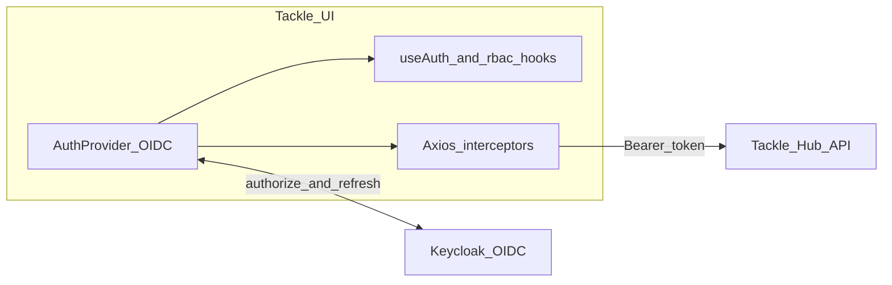

# Adopt a modern OIDC client and unified authorization on the UI

## Release Signoff Checklist

- [ ] Enhancement is `implementable`
- [ ] Design details are appropriately documented from clear requirements
- [ ] Test plan is defined
- [ ] User-facing documentation is created

## Open Questions

- Whether operator changes are needed for redirect URI allowlists after switching OIDC client libraries (validate against current Keycloak client registration).
- Long-term: supporting non-Keycloak IdPs may require additional metadata or UX; out of scope unless product requests it.

## Summary

This enhancement implements [RFE issue #268](https://github.com/konveyor/enhancements/issues/268): migrate the Tackle UI off the deprecated `@react-keycloak/web` integration, adopt a maintained OIDC-oriented client stack, centralize realm-role and API-scope checks behind a single API, add an optional development “masquerade” when authentication is disabled, and define one explicit, testable flow for access-token expiry (proactive refresh, 401 retry, and re-login on failure).

## Motivation

The UI today relies on `keycloak-js` together with `@react-keycloak/web`. The React bindings are unmaintained and block a clear upgrade path for authentication code.

Authorization checks are inconsistent: many modules read `keycloak.tokenParsed` directly (for example `RBAC`, `RouteWrapper`, sidebar navigation, hooks, and several pages), while `axios` interceptors in `apiInit.ts` handle 401 with `updateToken`. Comments such as the TODO in `RouteWrapper` show that token expiry and session invalidation are not handled uniformly.

### Goals

- Replace `@react-keycloak/web` with a supported OIDC client integration suitable for a browser SPA.
- Provide a **single** UI-facing API for auth state and authorization (for example context plus hooks such as `useAuth`, `useHasRealmRoles`, `useHasScopes`), backed by parsed token claims; migrate `RBAC`, route guards, and ad-hoc checks to use it only.
- Document and implement **one** behavior for expired or invalid access tokens: attach Bearer tokens on API requests, refresh when needed, retry failed requests after refresh, and redirect to login when refresh is not possible.
- When `AUTH_REQUIRED` is false, support optional **masquerade** of realm roles and scopes so developers can exercise RBAC without a full auth-enabled deployment.

### Non-Goals

- Redesigning the Hub API authorization model (realm roles and scopes remain as today unless a technical blocker appears).
- Changing Keycloak realm or client configuration in the operator/Helm charts unless required for redirect URIs or client settings implied by the chosen OIDC flow.
- Rewriting all Cypress Keycloak automation in the first change set (list as follow-up if URLs or storage keys change).

## Decisions

The following choices are locked for the implementation sketch so the proposal can be marked **implementable**; maintainers may adjust after review.

| Topic | Decision |
| ----- | -------- |
| Client stack | Use **[oidc-client-ts](https://github.com/authts/oidc-client-ts)** with **[react-oidc-context](https://github.com/authts/react-oidc-context)** as the primary integration: standards-based OIDC, active maintenance, and a React provider model that replaces `ReactKeycloakProvider`. |
| Flow | **Authorization Code with PKCE** (library default for SPA), aligned with Keycloak public client usage. |
| Token storage | Rely on library-managed persistence appropriate for SPA + PKCE (typically **sessionStorage** for user session artifacts). Document threat model briefly in operator/user docs (XSS remains a concern for any browser-stored tokens). |
| Keycloak-specific URLs | Derive authority and metadata from existing UI configuration (`/auth`, realm, client id) so deployments behind the ingress proxy continue to work. |
| Dev masquerade | When authentication is **disabled**, allow synthetic roles/scopes from **environment variables** (build-time) and optional **localStorage** overrides, gated so they **cannot** activate when `AUTH_REQUIRED` is true. No query-param masquerade (avoids accidental sharing of URLs). |
| Status | `implementable` once this document is merged; implementation targets [tackle2-ui](https://github.com/konveyor/tackle2-ui) with cross-reference to [issue #268](https://github.com/konveyor/enhancements/issues/268). |

## Proposal

### High-level architecture

1. **Bootstrap** — Replace `ReactKeycloakProvider` with `AuthProvider` from `react-oidc-context` (or equivalent thin wrapper). Preserve the fast path when `AUTH_REQUIRED !== "true"` (no OIDC redirect).
2. **Configuration** — Map `KEYCLOAK_REALM`, `KEYCLOAK_CLIENT_ID`, and the UI’s Keycloak base URL (`/auth`) to the OIDC authority and client metadata required by `oidc-client-ts`.
3. **RBAC** — Refactor `RBAC`, `RouteWrapper`, sidebar, header account menu, and pages that currently import the Keycloak singleton so they consume only the shared auth hooks/context. Keep `checkAccess` and scope/role groupings in `rbac.ts` (or adjacent module) but source **claims** from the auth layer, not `keycloak.tokenParsed` directly.
4. **HTTP** — Keep centralized Axios interceptors; obtain the access token and trigger refresh via the OIDC user manager / auth context API instead of `keycloak.updateToken` / `keycloak.login`.
5. **Masquerade** — When auth is disabled, merge synthetic roles/scopes from env (and optional localStorage) into the same hook surface used for real tokens so UI behavior matches production checks.

### User stories

- **Story 1** — With auth enabled, the user signs in via OIDC; API requests send `Authorization: Bearer <access_token>`; tokens refresh without manual re-login until refresh fails, then the user is redirected to sign in again.
- **Story 2** — With auth disabled, a developer enables masquerade (preset or custom roles/scopes) and sees the same enable/disable patterns for actions and navigation as in an auth-enabled install.
- **Story 3** — A contributor adds a new permission check using only the documented hooks/API; no new direct parsing of raw JWT payloads in feature code.

### Implementation details / notes

Primary repo: [konveyor/tackle2-ui](https://github.com/konveyor/tackle2-ui). Illustrative paths in that tree:

| Area | Files / locations |
| ---- | ----------------- |
| Provider / init | `client/src/app/components/KeycloakProvider.tsx`, `client/src/app/keycloak.ts` |
| RBAC | `client/src/app/rbac.ts`, `client/src/app/utils/rbac-utils.ts`, `client/src/app/components/RouteWrapper.tsx` |
| Token usage | `client/src/app/layout/SidebarApp/SidebarApp.tsx`, `client/src/app/layout/HeaderApp/SsoToolbarItem.tsx`, `client/src/app/hooks/useIsArchitect.ts`, and pages that read `tokenParsed` (e.g. applications, archetypes, migration-targets) |
| HTTP | `client/src/app/axios-config/apiInit.ts` |
| Tests | `client/src/app/test-config/setupTests.ts` (mock auth context) |
| E2E | `cypress/` Keycloak models and RBAC specs if login URLs or session storage keys change |

Remove `@react-keycloak/web` and `@react-keycloak/core` from `client/package.json` when the migration is complete; add `oidc-client-ts` and `react-oidc-context`.

## Design Details

### Test plan

- **Unit tests** — Auth context and hooks with mocked OIDC user / claims; masquerade branch when auth is off; `checkAccess` with injected role and scope lists.
- **Integration tests** — Axios: simulated 401 triggers token refresh and request retry; refresh failure triggers sign-in redirect (mock user manager).
- **E2E** — Existing RBAC flows should continue to pass; add or adjust scenarios for forbidden routes and post-login navigation. If feasible, add a targeted test for forced expiry (e.g. invalid token or IdP-side revocation) in a follow-up.

### Risks

- Subtle regressions where both realm roles and fine-grained scopes gate the same UI (must preserve current semantics).
- Redirect URI and proxy base path (`/auth`) must stay consistent with OpenShift/nginx and Keycloak client settings.
- Cypress stability if storage keys or login redirect URLs change.

## Implementation History

| Date | PR / note |
| ---- | --------- |
| TBD | Initial tackle2-ui implementation — link PR here when opened. |

Tracking issue: [konveyor/enhancements#268](https://github.com/konveyor/enhancements/issues/268).

## Drawbacks

- Touches many UI modules; reviewers need to validate RBAC parity.
- Contributors must adopt the new hooks-only pattern (short internal doc or comment in auth module helps).

## Alternatives

- **Minimal change** — Keep `keycloak-js` only, remove `@react-keycloak/web`, and implement a small custom React context around the Keycloak instance. Fewer new dependencies, but less alignment with generic OIDC and more bespoke refresh/error handling.
- **Other OIDC libraries** — Possible but rejected for this proposal in favor of the widely used `oidc-client-ts` + `react-oidc-context` pair.

## Upstream contribution

When opening the pull request in [konveyor/enhancements](https://github.com/konveyor/enhancements), this file is already at the expected path relative to that repository:

`enhancements/ui-oidc/README.md`

Include in the PR description:

- Link to [issue #268](https://github.com/konveyor/enhancements/issues/268).
- Short note that implementation lives in tackle2-ui and will reference this enhancement path once merged.

Optional additions after review: sequence diagram for login and refresh, screenshots of masquerade dev UI, and a table mapping existing environment variables to OIDC settings.
